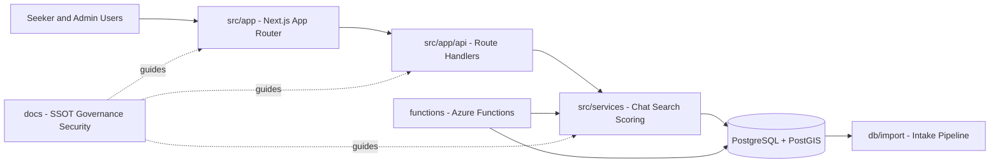

# ORAN - Open Resource Access Network

ORAN is a civic-grade, safety-critical platform for finding government, state, county, nonprofit, and community services quickly and safely.

[](https://github.com/AutomatedEmpires/Open-Resource-Access-Network/actions/workflows/ci.yml)
[](https://github.com/AutomatedEmpires/Open-Resource-Access-Network/actions/workflows/codeql.yml)
[](https://github.com/AutomatedEmpires/Open-Resource-Access-Network/actions/workflows/runbook-freshness.yml)
[](https://github.com/AutomatedEmpires/Open-Resource-Access-Network/actions/workflows/deploy-azure-appservice.yml)
[](https://github.com/AutomatedEmpires/Open-Resource-Access-Network/actions/workflows/deploy-azure-functions.yml)

## Experience Hub

| Need | Go To |
| --- | --- |
| Role-based onboarding | [START_HERE.md](START_HERE.md) |
| Live proof and assurance panel | [docs/EVIDENCE_DASHBOARD.md](docs/EVIDENCE_DASHBOARD.md) |
| Verified dev setup and command paths | [docs/DEVELOPER_GOLDEN_PATH.md](docs/DEVELOPER_GOLDEN_PATH.md) |
| Visual architecture and change map | [docs/REPO_MAP.md](docs/REPO_MAP.md) |
| Behavior guarantees and contracts | [docs/contracts/README.md](docs/contracts/README.md) |
| Public now/next/later roadmap | [docs/ROADMAP_PUBLIC.md](docs/ROADMAP_PUBLIC.md) |
| Operational command center | [docs/ops/README.md](docs/ops/README.md) |

<details>
<summary>Interactive first-click paths</summary>

- Investor / executive: [START_HERE.md#investor-lane](START_HERE.md#investor-lane)
- Developer: [START_HERE.md#developer-lane](START_HERE.md#developer-lane)
- Operator / on-call: [START_HERE.md#operator-lane](START_HERE.md#operator-lane)
- Contributor: [START_HERE.md#contributor-lane](START_HERE.md#contributor-lane)

</details>

## Executive Snapshot

| Dimension | Position | Evidence |
| --- | --- | --- |
| Safety model | Retrieval-first with crisis hard-gate behavior | `docs/CHAT_ARCHITECTURE.md`, `docs/VISION.md` |
| Data trust | Import-first and verification-first publication model | `docs/solutions/IMPORT_PIPELINE.md`, `db/import/README.md` |
| Engineering discipline | Strict TypeScript, CI quality gates, security scanning | `.github/workflows/ci.yml`, `.github/workflows/codeql.yml` |
| Governance | SSOT hierarchy plus operating model and ADRs | `docs/SSOT.md`, `docs/governance/OPERATING_MODEL.md`, `docs/DECISIONS/` |
| Deployment posture | Azure-first production architecture and runbooks | `docs/platform/DEPLOYMENT_AZURE.md`, `infra/README.md` |

## Platform Status

### Quality And Assurance

[](https://github.com/AutomatedEmpires/Open-Resource-Access-Network/actions/workflows/ci.yml)
[](https://github.com/AutomatedEmpires/Open-Resource-Access-Network/actions/workflows/a11y.yml)
[](https://github.com/AutomatedEmpires/Open-Resource-Access-Network/actions/workflows/bundle-size.yml)
[](https://github.com/AutomatedEmpires/Open-Resource-Access-Network/actions/workflows/visual-regression.yml)
[](https://github.com/AutomatedEmpires/Open-Resource-Access-Network/actions/workflows/runbook-freshness.yml)

### Security

[](https://github.com/AutomatedEmpires/Open-Resource-Access-Network/actions/workflows/codeql.yml)

### Delivery

[](https://github.com/AutomatedEmpires/Open-Resource-Access-Network/actions/workflows/deploy-infra.yml)
[](https://github.com/AutomatedEmpires/Open-Resource-Access-Network/actions/workflows/deploy-azure-appservice.yml)
[](https://github.com/AutomatedEmpires/Open-Resource-Access-Network/actions/workflows/deploy-azure-functions.yml)

## Production Deployment Path

1. Review deployment architecture and prerequisites in `docs/platform/DEPLOYMENT_AZURE.md`.
2. Validate infrastructure definitions in `infra/main.bicep` and environment parameters.
3. Deploy infrastructure with `.github/workflows/deploy-infra.yml`.
4. Deploy application workloads with `.github/workflows/deploy-azure-appservice.yml` and `.github/workflows/deploy-azure-functions.yml`.
5. Apply database migrations using `db/migrations/` and `npx drizzle-kit migrate`.
6. Confirm release health in Actions and security dashboards.

Release operations links:

- Actions dashboard: <https://github.com/AutomatedEmpires/Open-Resource-Access-Network/actions>
- Open pull requests: <https://github.com/AutomatedEmpires/Open-Resource-Access-Network/pulls>
- Open issues: <https://github.com/AutomatedEmpires/Open-Resource-Access-Network/issues>
- Code scanning alerts: <https://github.com/AutomatedEmpires/Open-Resource-Access-Network/security/code-scanning>
- Dependabot alerts: <https://github.com/AutomatedEmpires/Open-Resource-Access-Network/security/dependabot>

## Start Here By Role

- Product and policy reviewers: `docs/README.md`, `docs/VISION.md`, `docs/SSOT.md`
- Engineers implementing behavior: `docs/CHAT_ARCHITECTURE.md`, `docs/SCORING_MODEL.md`, `src/services/README.md`
- Security and compliance reviewers: `SECURITY.md`, `docs/SECURITY_PRIVACY.md`, `docs/governance/OPERATING_MODEL.md`
- Contributors and maintainers: `CONTRIBUTING.md`, `.github/PULL_REQUEST_TEMPLATE.md`, `SUPPORT.md`

## Getting Started In 5 Minutes

1. Read `docs/SSOT.md` and `docs/governance/OPERATING_MODEL.md` to understand authoritative behavior and safety guardrails.
2. Start locally:

```bash
npm install
npm run dev
```

3. Open `http://localhost:3000`.
4. Optional local database:

```bash
docker compose -f db/docker-compose.yml up -d
```

5. Validate changes with `npm run lint`, `npx tsc --noEmit`, and `npm run test`.

## Why ORAN

- Retrieval-first recommendations using stored records only.
- Safety-critical crisis routing for imminent-risk scenarios.
- Verification-first data lifecycle from ingest to publish.
- Deterministic scoring and confidence contracts.
- Enterprise-grade quality gates in CI/CD and security scanning.

## Non-Negotiables

- **Retrieval-first**: recommendations must come from stored records only.
- **No hallucinated facts**: never invent services, phone numbers, addresses, hours, eligibility, or URLs.
- **Crisis hard gate**: if imminent risk is detected, route immediately to **911 / 988 / 211**.
- **Eligibility caution**: never guarantee eligibility; use "may qualify" and "confirm with provider" language.
- **Privacy-first**: approximate location by default; explicit consent before saving profile details.

## Engineering Quality Gates

- `CI`: lint, strict typecheck, tests with coverage, production build, security audit.
- `CodeQL`: code scanning for code-level vulnerabilities.
- `Accessibility Gate`: UI accessibility checks on key surface changes.
- `Bundle Size Budget`: bundle growth enforcement to prevent performance drift.
- `Visual Regression`: snapshot-based UI regression detection.
- `Deploy` workflows: release automation pathways for infrastructure and workloads.

## Architecture At A Glance

- `src/app/**`: Next.js App Router pages and API routes.
- `src/services/**`: chat/search/scoring orchestration and domain business logic.
- `src/domain/**`: core types, constraints, and constants.
- `db/**`: migrations, import pipeline, and local data workflows.
- `functions/**`: Azure Functions for data and operational workflows.
- `docs/**`: authoritative specifications, governance, and operating model.



## Data Lifecycle (Import-First)

ORAN is designed to start with an empty directory and populate services through imports and verification.

1. Import HSDS CSV/JSON into staging.
2. Mark imported records as `unverified`.
3. Review through moderation queues.
4. Verify and publish records.
5. Recompute confidence scores.

`db/seed/demo.sql` is optional and demo-only with fictional data.

## Trust, Security, And Governance

- Security policy and reporting: `SECURITY.md`
- Security and privacy requirements: `docs/SECURITY_PRIVACY.md`
- Operating model: `docs/governance/OPERATING_MODEL.md`
- Engineering decision records (ADRs): `docs/DECISIONS/`
- Engineering change log: `docs/ENGINEERING_LOG.md`

## Contributing And Collaboration

- Contributor workflow: `CONTRIBUTING.md`
- Issue forms and triage entry points: `.github/ISSUE_TEMPLATE/`
- Pull request checklist: `.github/PULL_REQUEST_TEMPLATE.md`
- Community standards: `CODE_OF_CONDUCT.md`
- Support routing: `SUPPORT.md`
