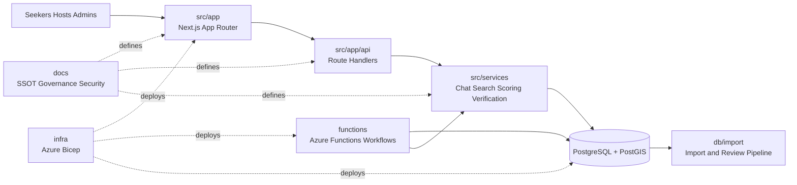

# ORAN | Open Resource Access Network

> Big, bold civic infrastructure for fast, modern, verified resource matching.

**Mission statement:** ORAN is building a user-friendly, modern system that rapidly connects people to the resources most applicable to them, using verified inputs, transparent scoring, and reproducible results.

ORAN exists because finding help is still too fragmented, too slow, and too easy to get wrong. This platform is being built from lived pain with broken discovery, unclear eligibility, stale listings, and systems that make people do too much work just to find what might help. The goal is a next-generation resource matching tool that feels intuitive for younger users, trustworthy for families, useful for organizations, and rigorous enough for operators, partners, and investors.

## Live Signals

[](https://github.com/AutomatedEmpires/Open-Resource-Access-Network/actions/workflows/ci.yml)
[](https://github.com/AutomatedEmpires/Open-Resource-Access-Network/actions/workflows/codeql.yml)
[](https://github.com/AutomatedEmpires/Open-Resource-Access-Network/actions/workflows/a11y.yml)
[](https://github.com/AutomatedEmpires/Open-Resource-Access-Network/actions/workflows/visual-regression.yml)
[](https://github.com/AutomatedEmpires/Open-Resource-Access-Network/actions/workflows/bundle-size.yml)
[](https://github.com/AutomatedEmpires/Open-Resource-Access-Network/actions/workflows/runbook-freshness.yml)
[](https://github.com/AutomatedEmpires/Open-Resource-Access-Network/actions/workflows/deploy-infra.yml)
[](https://github.com/AutomatedEmpires/Open-Resource-Access-Network/actions/workflows/deploy-azure-appservice.yml)
[](https://github.com/AutomatedEmpires/Open-Resource-Access-Network/actions/workflows/deploy-azure-functions.yml)


## Why ORAN Hits Different

ORAN is not trying to be another generic directory. It is trying to become the trusted operating layer between people, organizations, and real-world services.

| Problem | ORAN Response |
| --- | --- |
| Listings are stale, vague, or contradictory | Preserve provenance, route through verification, and score trust explicitly |
| Help seekers waste time chasing weak leads | Match faster with structured retrieval, geographic relevance, and constrained scoring |
| AI systems improvise facts they should not invent | Keep retrieval and ranking grounded in stored records only |
| Users need modern UX, not bureaucratic friction | Build for speed, clarity, mobile direction, and younger-user expectations |

## Signal-Rich Snapshot

| Dimension | ORAN Position | Evidence |
| --- | --- | --- |
| Service truth model | Recommendations come from stored records only | [docs/VISION.md](docs/VISION.md), [docs/CHAT_ARCHITECTURE.md](docs/CHAT_ARCHITECTURE.md) |
| Safety posture | Crisis routing happens before normal response flow | [docs/VISION.md](docs/VISION.md), [docs/SECURITY_PRIVACY.md](docs/SECURITY_PRIVACY.md) |
| Data trust | Import-first, verify-before-publish lifecycle | [docs/contracts/INGESTION_CONTRACT.md](docs/contracts/INGESTION_CONTRACT.md), [db/README.md](db/README.md) |
| Match discipline | Deterministic trust and match scoring | [docs/SCORING_MODEL.md](docs/SCORING_MODEL.md), [docs/contracts/SCORING_CONTRACT.md](docs/contracts/SCORING_CONTRACT.md) |
| AI boundaries | AI can assist ingestion and summarization, not seeker-facing fact invention | [docs/CHAT_ARCHITECTURE.md](docs/CHAT_ARCHITECTURE.md), [docs/agents/AGENTS_OVERVIEW.md](docs/agents/AGENTS_OVERVIEW.md), [docs/platform/OWNER_INFO.md](docs/platform/OWNER_INFO.md) |
| Platform posture | Azure-first web, functions, secrets, and data stack | [docs/platform/PLATFORM_AZURE.md](docs/platform/PLATFORM_AZURE.md), [infra/README.md](infra/README.md) |
| External brief | Investor, partner, and collaborator brief with proof links | [docs/INVESTOR_PARTNER_BRIEF.md](docs/INVESTOR_PARTNER_BRIEF.md) |

## How ORAN Works

| Stage | What Happens | Why It Matters |
| --- | --- | --- |
| Source | Candidate records come from imports, submissions, and approved source discovery | Growth starts with provenance, not guesswork |
| Verify | Evidence is checked, candidates are routed for review, and unsafe/stale records stay out of seeker surfaces | Trust is earned before exposure |
| Score | Verification confidence, eligibility match, and constraint fit are calculated deterministically | Results stay explainable and reproducible |
| Deliver | Chat, directory, and map experiences surface the strongest applicable records | Users get faster, clearer next steps |

## Where Data Comes From

ORAN is designed to grow from real source material, not fabricated catalogs.

- Structured imports and staging flows from the data pipeline in [db/README.md](db/README.md).
- Source-driven ingestion governed by [docs/agents/AGENTS_SOURCE_REGISTRY.md](docs/agents/AGENTS_SOURCE_REGISTRY.md).
- Internal extraction and ingestion workflows defined by [docs/contracts/INGESTION_CONTRACT.md](docs/contracts/INGESTION_CONTRACT.md) and [docs/solutions/IMPORT_PIPELINE.md](docs/solutions/IMPORT_PIPELINE.md).
- Staff and organization submissions that still route through review and verification.

The hard rule is simple: external content can assist ingestion, but it does not get shown directly to seekers without staging, review, and publish controls.

## How Trust Is Earned

| Trust Layer | ORAN Rule |
| --- | --- |
| Provenance | Preserve source URLs, snapshots, evidence, and reviewability |
| Verification | Unverified data does not publish as trusted seeker-facing content |
| Scoring | Same inputs produce the same results |
| Monitoring | Backlogs, SLA drift, and regressions trigger operational responses |
| Reverification | Stale or degraded listings move back into review instead of silently lingering |

## How Scoring Works

ORAN separates trust from fit so the product stays honest.

| Public Score | Meaning |
| --- | --- |
| Verification Confidence | How verified and reliable the listing appears |
| Eligibility Match | How well the listing fits the user's stated needs |
| Constraint Fit | How actionable the listing is right now given practical constraints |

Stored overall score:

```text
final = 0.45 * verification
      + 0.40 * eligibility
      + 0.15 * constraint
```

Reference: [docs/SCORING_MODEL.md](docs/SCORING_MODEL.md)

## How AI Is Used

ORAN uses AI in carefully bounded places, not as a license to invent.

- AI may assist with extraction, categorization, ingestion support, and optional post-retrieval summarization.
- AI does not retrieve services, rank services, or inject new facts into seeker answers.
- Seeker-facing answers must remain grounded in stored records.
- Crisis routing remains rule-driven and safety-first.

References: [docs/CHAT_ARCHITECTURE.md](docs/CHAT_ARCHITECTURE.md), [docs/agents/AGENTS_OVERVIEW.md](docs/agents/AGENTS_OVERVIEW.md), [docs/platform/OWNER_INFO.md](docs/platform/OWNER_INFO.md)

## Product Areas

| Area | Primary User | What It Unlocks | Reference |
| --- | --- | --- | --- |
| Seeker surface | People trying to find help quickly | Chat, discovery, saved services, profile, map, directory | [src/app/(seeker)/README.md](src/app/(seeker)/README.md) |
| Host surface | Organizations maintaining listings | Manage organizations, services, locations, and team workflows | [src/app/(host)/README.md](src/app/(host)/README.md) |
| Community admin surface | Local verifiers and reviewers | Verification queue, coverage workflows, review operations | [src/app/(community-admin)/README.md](src/app/(community-admin)/README.md) |
| ORAN admin surface | Global platform operators | Rules, approvals, audits, ingestion jobs, governance | [src/app/(oran-admin)/README.md](src/app/(oran-admin)/README.md) |

## For Investors, Partners, And Builders

ORAN is looking for collaborators who understand that trust, distribution, and product quality all matter at the same time.

| We want to talk to... | Why |
| --- | --- |
| Investors | To accelerate product execution, trust infrastructure, and distribution |
| Government and nonprofit partners | To improve verified supply, sourcing quality, and local relevance |
| Universities and youth-facing programs | To help younger users learn how to maximize available support in expensive markets |
| Technical collaborators | To strengthen product UX, data systems, AI tooling, and mobile direction |

External brief: [docs/INVESTOR_PARTNER_BRIEF.md](docs/INVESTOR_PARTNER_BRIEF.md)

## What Comes Next

- Deeper public trust evidence and partnership collateral.
- Stronger seeker and organization workflows.
- Continued expansion of verification and sourcing infrastructure.
- Mobile app direction for faster, more accessible everyday use.

Roadmap: [docs/ROADMAP_PUBLIC.md](docs/ROADMAP_PUBLIC.md)

## Architecture At A Glance



## Repo Guide

| If you want to inspect... | Start here |
| --- | --- |
| Mission and product direction | [docs/VISION.md](docs/VISION.md) |
| Investor and partner brief | [docs/INVESTOR_PARTNER_BRIEF.md](docs/INVESTOR_PARTNER_BRIEF.md) |
| System truth hierarchy | [docs/SSOT.md](docs/SSOT.md) |
| Chat and retrieval behavior | [docs/CHAT_ARCHITECTURE.md](docs/CHAT_ARCHITECTURE.md) |
| Scoring model and ranking logic | [docs/SCORING_MODEL.md](docs/SCORING_MODEL.md) |
| Data sourcing and ingestion | [docs/solutions/IMPORT_PIPELINE.md](docs/solutions/IMPORT_PIPELINE.md) |
| Source governance | [docs/agents/AGENTS_SOURCE_REGISTRY.md](docs/agents/AGENTS_SOURCE_REGISTRY.md) |
| Security and privacy controls | [docs/SECURITY_PRIVACY.md](docs/SECURITY_PRIVACY.md) |
| Evidence and workflow health | [docs/EVIDENCE_DASHBOARD.md](docs/EVIDENCE_DASHBOARD.md) |
| Azure platform direction | [docs/platform/PLATFORM_AZURE.md](docs/platform/PLATFORM_AZURE.md) |
| Azure dashboard modernization plan | [docs/platform/AZURE_DASHBOARD_MODERNIZATION.md](docs/platform/AZURE_DASHBOARD_MODERNIZATION.md) |
| Enterprise evolution strategy | [docs/platform/ENTERPRISE_EVOLUTION_STRATEGY.md](docs/platform/ENTERPRISE_EVOLUTION_STRATEGY.md) |
| Infrastructure as code | [infra/README.md](infra/README.md) |

## Quick Start

```bash
npm install
npm run dev
```

Open `http://localhost:3000`.

Optional local database:

```bash
docker compose -f db/docker-compose.yml up -d
```

Recommended validation path:

```bash
npm run lint
npx tsc --noEmit
npm run test
```

## Delivery And Review Links

- Actions dashboard: <https://github.com/AutomatedEmpires/Open-Resource-Access-Network/actions>
- Pull requests: <https://github.com/AutomatedEmpires/Open-Resource-Access-Network/pulls>
- Issues: <https://github.com/AutomatedEmpires/Open-Resource-Access-Network/issues>
- Code scanning: <https://github.com/AutomatedEmpires/Open-Resource-Access-Network/security/code-scanning>
- Dependabot alerts: <https://github.com/AutomatedEmpires/Open-Resource-Access-Network/security/dependabot>

## Trust, Security, And Governance

- Security policy: [SECURITY.md](SECURITY.md)
- Security and privacy requirements: [docs/SECURITY_PRIVACY.md](docs/SECURITY_PRIVACY.md)
- Engineering operating model: [docs/governance/OPERATING_MODEL.md](docs/governance/OPERATING_MODEL.md)
- Architecture and system docs: [docs/README.md](docs/README.md)
- ADRs and decisions: [docs/DECISIONS](docs/DECISIONS)
- Engineering log: [docs/ENGINEERING_LOG.md](docs/ENGINEERING_LOG.md)

## Join The Build

If you want to help shape a faster, more trustworthy way for people to find support, ORAN is open to serious conversations across product, civic data, verification workflows, partnerships, and platform engineering.

- Contributor guide: [CONTRIBUTING.md](CONTRIBUTING.md)
- Investor and partner brief: [docs/INVESTOR_PARTNER_BRIEF.md](docs/INVESTOR_PARTNER_BRIEF.md)
- Pull request checklist: [.github/PULL_REQUEST_TEMPLATE.md](.github/PULL_REQUEST_TEMPLATE.md)
- Support routing: [SUPPORT.md](SUPPORT.md)
- Code of conduct: [CODE_OF_CONDUCT.md](CODE_OF_CONDUCT.md)
