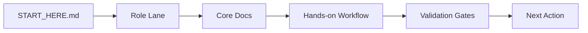

# START HERE - ORAN

This page is the fastest way to onboard as an investor, developer, operator, or contributor.

## Choose Your Path

| Audience | Start Here | Time | Outcome |
| --- | --- | --- | --- |
| Investor / Executive | [Investor lane](#investor-lane) | 10 min | Mission, risk controls, delivery proof |
| Developer | [Developer lane](#developer-lane) | 15 min | Local run, architecture map, first change |
| Operator / On-call | [Operator lane](#operator-lane) | 12 min | Incident flow, runbooks, recovery drills |
| Contributor | [Contributor lane](#contributor-lane) | 10 min | Contribution workflow and quality gates |

## Visual Orientation



## Investor Lane

- Read `README.md` for platform overview and live status badges.
- Use `docs/EVIDENCE_DASHBOARD.md` for centralized live proof links.
- Read `docs/VISION.md` and `docs/SSOT.md` for strategic and safety posture.
- Read `docs/SECURITY_PRIVACY.md` and `docs/governance/OPERATING_MODEL.md` for controls.
- Read `docs/ops/core/OPERATIONS_READINESS.md` for operational maturity.

<details>
<summary>Investor Fast Checklist</summary>

- [ ] Mission and non-negotiables understood.
- [ ] Security and privacy controls reviewed.
- [ ] Delivery quality signals reviewed (CI, CodeQL, deploy workflows).
- [ ] Operational readiness and runbook coverage reviewed.

</details>

## Developer Lane

- Read `docs/REPO_MAP.md`.
- Read `docs/contracts/README.md`.
- Follow verified setup and validation commands in `docs/DEVELOPER_GOLDEN_PATH.md`.
- Start local dev:

```bash
npm install
npm run dev
```

- Validate quality:

```bash
npm run lint
npx tsc --noEmit
npm run test
```

<details>
<summary>Developer First Change Workflow</summary>

1. Identify impacted contract in `docs/contracts/`.
2. Implement change in `src/**`.
3. Add or update tests.
4. Update SSOT and ops docs if contract behavior changed.
5. Open PR with risk and rollback notes.

</details>

## Operator Lane

- Start at `docs/ops/README.md`.
- Use `docs/ops/core/RUNBOOK_INCIDENT_TRIAGE.md` for first-response command.
- Follow service-specific runbooks in `docs/ops/services/` and `docs/ops/security/`.
- Review drills and readiness in `docs/ops/core/OPERATIONS_READINESS.md`.

<details>
<summary>First 15 Minutes Incident Flow</summary>

1. Classify severity.
2. Assign IC, operations driver, communications lead.
3. Route to the matching runbook.
4. Stabilize service and confirm exit criteria.
5. Capture timeline and post-incident actions.

</details>

## Contributor Lane

- Read `CONTRIBUTING.md` and `CODE_OF_CONDUCT.md`.
- Read `.github/PULL_REQUEST_TEMPLATE.md`.
- Use issue forms under `.github/ISSUE_TEMPLATE/`.
- Validate all quality gates before requesting review.

## Start Here References

- Docs index: `docs/README.md`
- Public roadmap: `docs/ROADMAP_PUBLIC.md`
- Contracts hub: `docs/contracts/README.md`
- Repo map: `docs/REPO_MAP.md`
