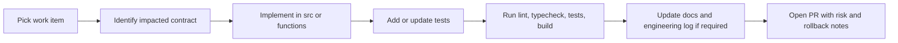

# Developer Golden Path

This guide lists the fastest verified workflows for local development, validation, and safe release preparation.

## Environment Baseline

- Node.js 20.x (matches CI workflow in `.github/workflows/ci.yml`)
- npm
- Optional: Docker (for local Postgres via `db/docker-compose.yml`)

## 1) Bootstrap And Run

```bash
npm install
npm run dev
```

Open `http://localhost:3000`.

## 2) Core Quality Gates (Same as CI)

```bash
npm run lint
npx tsc --noEmit
npm run test:coverage
npm run build
```

These commands are defined in `package.json` and mirrored in `.github/workflows/ci.yml`.

## 3) Focused Test Loops

```bash
npm run test:chat
npm run test:search
npm run test:scoring
```

Use these during feature development before full-suite runs.

## 4) Optional E2E Validation

```bash
npm run test:e2e
```

For interactive debugging:

```bash
npm run test:e2e:ui
```

## 5) Local Database Workflow (Optional)

Start local database:

```bash
docker compose -f db/docker-compose.yml up -d
```

Stop local database:

```bash
docker compose -f db/docker-compose.yml down
```

Apply migrations:

```bash
npx drizzle-kit migrate
```

## 6) Contract-Safe Change Flow



## 7) Required Docs Updates When Behavior Changes

- SSOT and architecture: `docs/SSOT.md`, `docs/CHAT_ARCHITECTURE.md`, `docs/SCORING_MODEL.md`, `docs/DATA_MODEL.md`
- Contracts: `docs/contracts/README.md` and affected contract files
- Ops procedures: `docs/ops/**` when operational behavior changes
- Contract-level changes: append UTC entry in `docs/ENGINEERING_LOG.md`

## 8) Fast Navigation

- Start-here role lanes: `START_HERE.md`
- Repository map: `docs/REPO_MAP.md`
- Contracts hub: `docs/contracts/README.md`
- Ops command center: `docs/ops/README.md`
