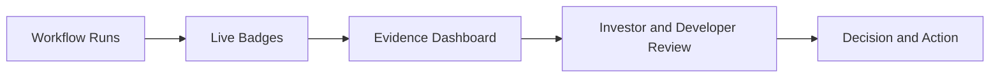

# ORAN Evidence Dashboard

This dashboard centralizes live, verifiable repository evidence for quality, security, delivery, and operations governance.

## Live Controls Board

| Control Area | Live Status | Primary Evidence | Secondary Evidence |
| --- | --- | --- | --- |
| CI validation | [](https://github.com/AutomatedEmpires/Open-Resource-Access-Network/actions/workflows/ci.yml) | `.github/workflows/ci.yml` | `package.json` scripts (`lint`, `typecheck`, `test:coverage`, `build`) |
| Code security scan | [](https://github.com/AutomatedEmpires/Open-Resource-Access-Network/actions/workflows/codeql.yml) | `.github/workflows/codeql.yml` | Code scanning: <https://github.com/AutomatedEmpires/Open-Resource-Access-Network/security/code-scanning> |
| Accessibility gate | [](https://github.com/AutomatedEmpires/Open-Resource-Access-Network/actions/workflows/a11y.yml) | `.github/workflows/a11y.yml` | UI governance: `scripts/audit-ui-consistency.mjs` |
| Bundle-size guardrail | [](https://github.com/AutomatedEmpires/Open-Resource-Access-Network/actions/workflows/bundle-size.yml) | `.github/workflows/bundle-size.yml` | `scripts/check-bundle-sizes.js` |
| Visual regression | [](https://github.com/AutomatedEmpires/Open-Resource-Access-Network/actions/workflows/visual-regression.yml) | `.github/workflows/visual-regression.yml` | e2e config: `playwright.config.ts` |
| Infra delivery | [](https://github.com/AutomatedEmpires/Open-Resource-Access-Network/actions/workflows/deploy-infra.yml) | `.github/workflows/deploy-infra.yml` | `infra/main.bicep` |
| App delivery | [](https://github.com/AutomatedEmpires/Open-Resource-Access-Network/actions/workflows/deploy-azure-appservice.yml) | `.github/workflows/deploy-azure-appservice.yml` | `docs/platform/DEPLOYMENT_AZURE.md` |
| Functions delivery | [](https://github.com/AutomatedEmpires/Open-Resource-Access-Network/actions/workflows/deploy-azure-functions.yml) | `.github/workflows/deploy-azure-functions.yml` | `functions/**` |
| Runbook governance freshness | [](https://github.com/AutomatedEmpires/Open-Resource-Access-Network/actions/workflows/runbook-freshness.yml) | `.github/workflows/runbook-freshness.yml` | `scripts/check-runbook-freshness.mjs` |

## Security And Governance Signals

- Security policy: `SECURITY.md`
- Security/privacy controls: `docs/SECURITY_PRIVACY.md`
- Dependabot alerts: <https://github.com/AutomatedEmpires/Open-Resource-Access-Network/security/dependabot>
- SSOT hierarchy: `docs/SSOT.md`
- Operating model: `docs/governance/OPERATING_MODEL.md`

## Evidence Flow



## Manual Verification Shortcuts

```bash
# Latest CI run

gh run list --workflow ci.yml --limit 1

# Latest runbook freshness run

gh run list --workflow runbook-freshness.yml --limit 1

# Latest CodeQL run

gh run list --workflow codeql.yml --limit 1
```

Use this page as a live control panel; use linked workflow files and docs as the canonical implementation details.
