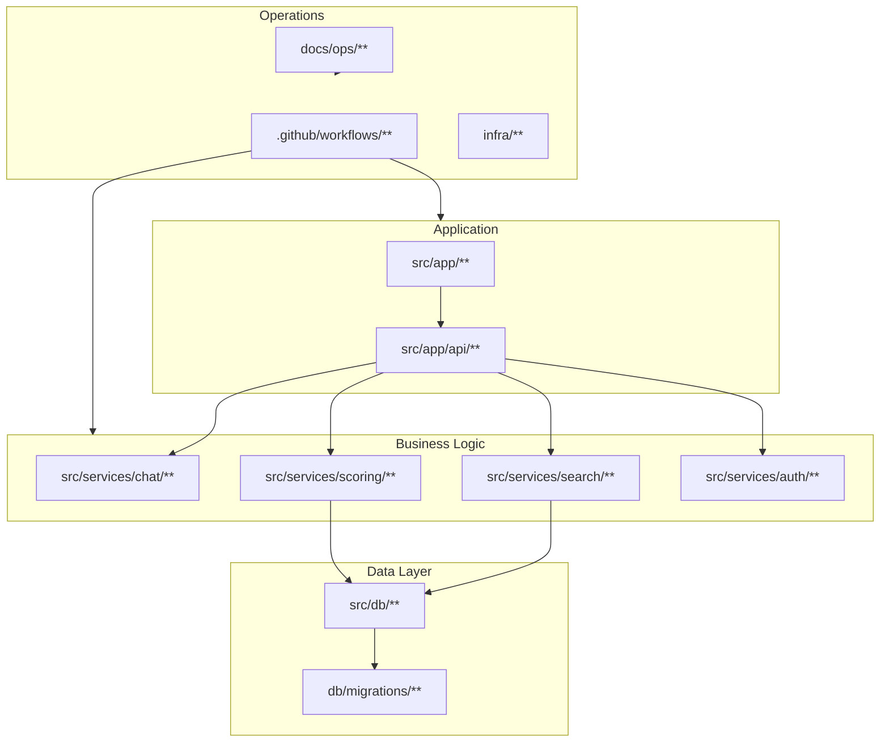

# ORAN Repository Map

A visual and task-oriented map of where core behavior lives.

## System Map

## Where To Change X

| Goal | Primary Files | Supporting Docs |
| --- | --- | --- |
| Change chat behavior | `src/services/chat/**` | `docs/CHAT_ARCHITECTURE.md` |
| Change search/retrieval | `src/services/search/**`, `src/app/api/search/**` | `docs/SCORING_MODEL.md` |
| Change scoring/confidence | `src/services/scoring/**` | `docs/SCORING_MODEL.md` |
| Change auth/roles | `src/services/auth/**`, `src/proxy.ts` | `docs/SECURITY_PRIVACY.md`, `docs/governance/ROLES_PERMISSIONS.md` |
| Change schema/data model | `db/migrations/**`, `src/domain/types.ts` | `docs/DATA_MODEL.md` |
| Change ingestion flow | `functions/**`, `src/app/api/admin/ingestion/**` | `docs/ops/services/RUNBOOK_INGESTION.md` |
| Change deploy/ops | `.github/workflows/**`, `infra/**`, `docs/ops/**` | `docs/platform/DEPLOYMENT_AZURE.md` |

## Change Impact Guide

If you change chat/search/scoring contracts

- Update relevant docs in `docs/contracts/`.
- Update SSOT docs and service README under `src/services/**`.
- Add UTC entry in `docs/ENGINEERING_LOG.md` for contract-level changes.
- Ensure tests cover behavior changes.

If you change infra or deployment workflows

- Update `docs/platform/PLATFORM_AZURE.md` and `docs/platform/INTEGRATIONS.md` as needed.
- Update corresponding ops runbooks in `docs/ops/**`.
- Validate deploy workflows and rollback references.

## Top Entry Points

- New to repo: `START_HERE.md`
- System docs index: `docs/README.md`
- Contracts index: `docs/contracts/README.md`
- Ops command center: `docs/ops/README.md`
