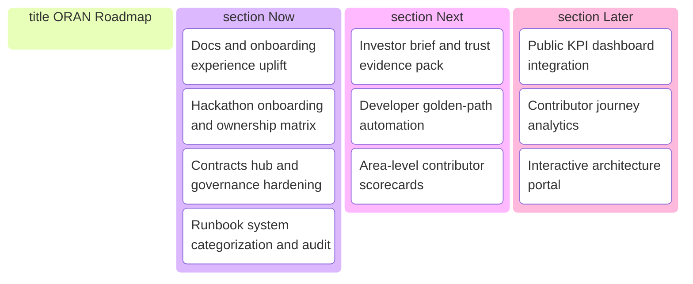

# ORAN Public Roadmap

This roadmap is designed for external visibility: what is shipping now, what is next, and what is under evaluation.

## Roadmap Board

## Now

- [x] Role-based START_HERE onboarding.
- [x] Hackathon onboarding command center and ownership matrix.
- [x] Interactive repository map.
- [x] Contracts hub and baseline contract set.
- [x] Ops runbook taxonomy and readiness matrix expansion.
- [x] CI guard for runbook review-date staleness.

## Next

- [ ] Public-facing investor brief with proof links.
- [ ] Unified command palette doc for dev + ops workflows.
- [ ] Area-level contributor scorecards and review dashboards.

## Later

- [ ] Automated release digest from engineering log and PR metadata.
- [ ] Architecture explorer with generated dependency maps.
- [ ] Public status and reliability scorecards.

## Update Cadence

- Weekly: progress refresh on Now/Next items.
- Monthly: objective-level review and risk update.
- Quarterly: strategic reprioritization.

## Governance

- SSOT precedence: `docs/SSOT.md`
- Operating model: `docs/governance/OPERATING_MODEL.md`
- Engineering log: `docs/ENGINEERING_LOG.md`
