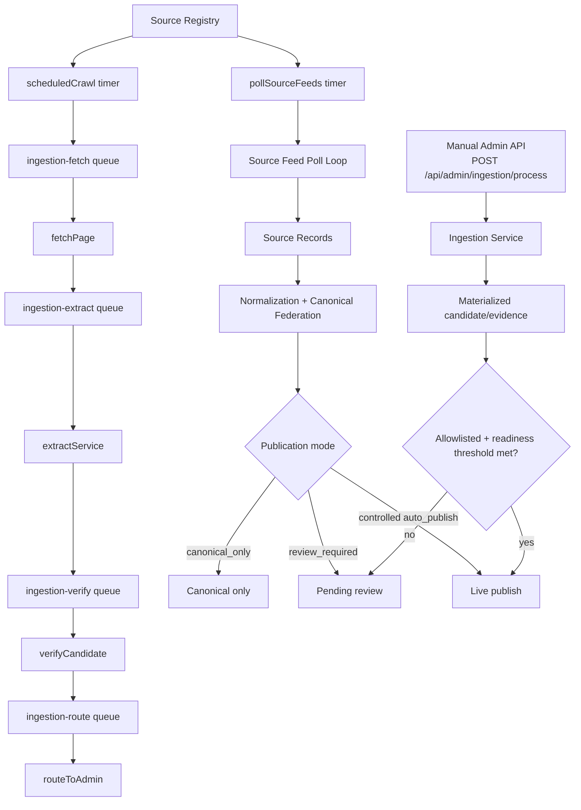
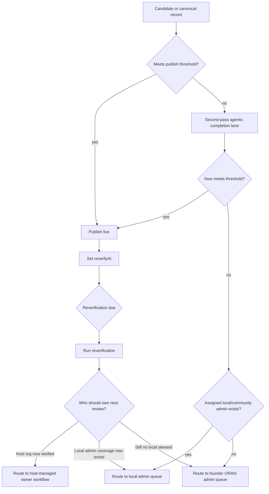
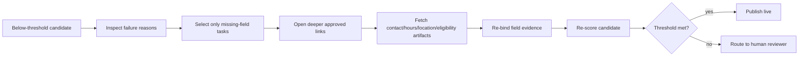
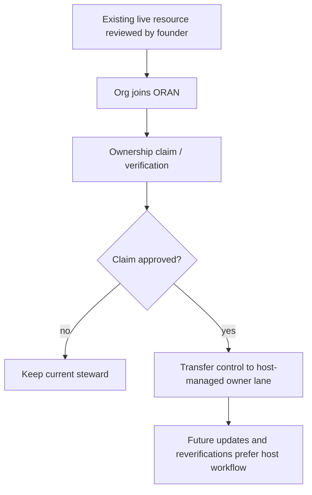
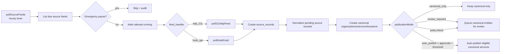
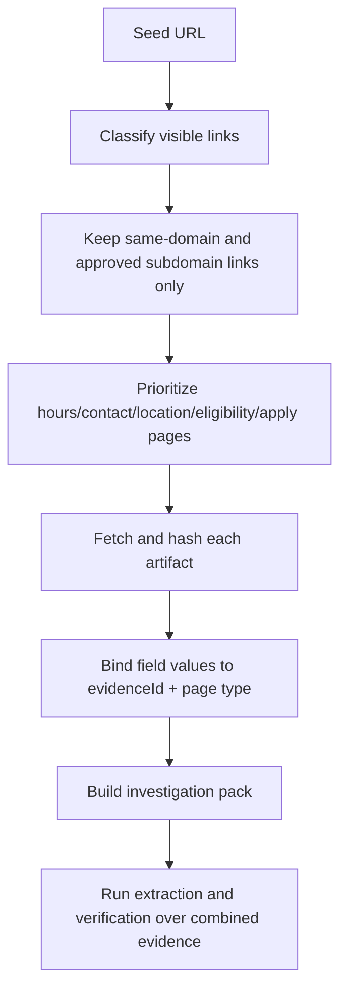
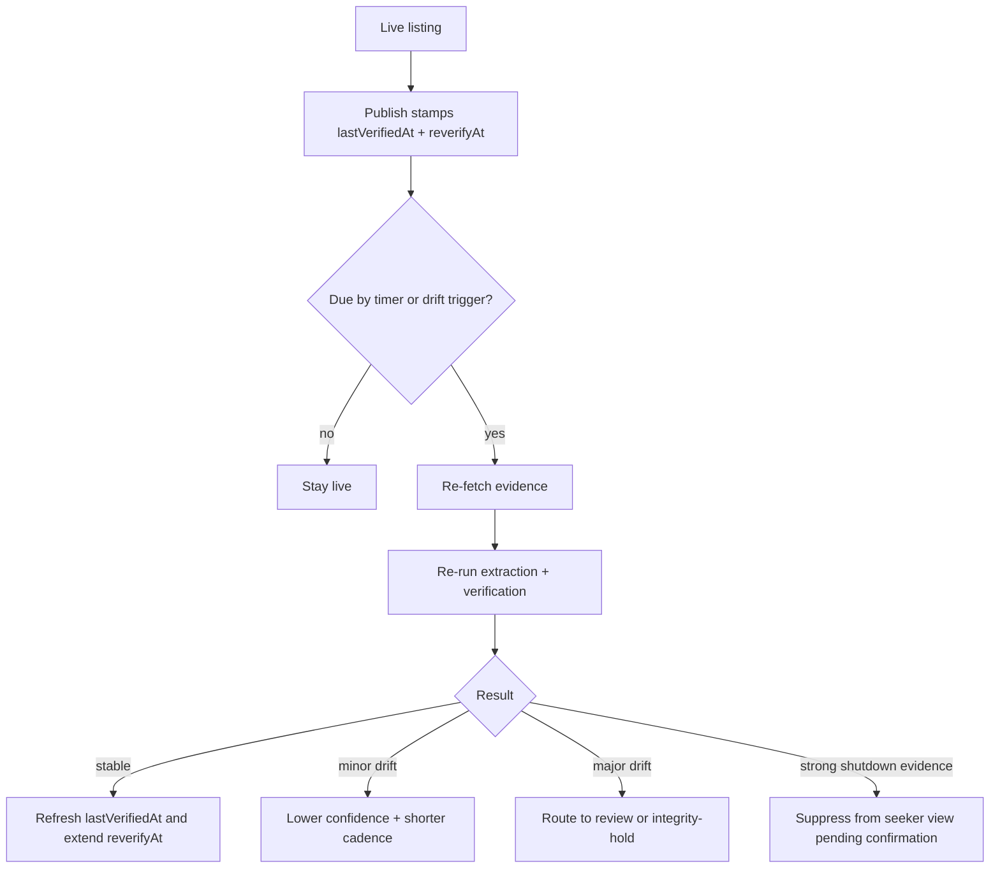
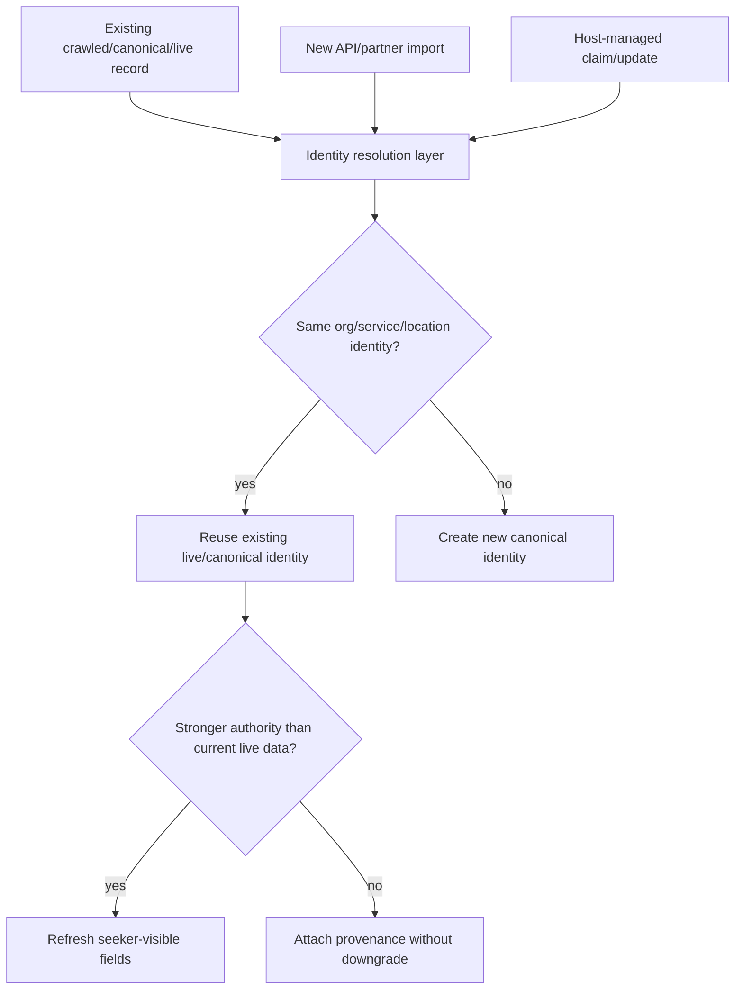

# ORAN Ingestion Flowchart And Launch Plan

This document explains how ORAN's ingestion agent actually runs today, what makes it complex, and what must be true before using the agent as the primary path to populate a large nationwide resource database.

It is intentionally split into:

- current implemented behavior in this repo
- near-term operating decisions
- million-record launch planning
- risk controls for accuracy, shutdown detection, reverification, and moderation overload

## Executive Summary

ORAN does not have one single "ingestion agent." It has a multi-lane ingestion system with two main entry paths:

1. crawl lane: allowlisted URLs move through `scheduledCrawl -> fetchPage -> extractService -> verifyCandidate -> routeToAdmin`
2. source-feed lane: trusted structured feeds are polled by `pollSourceFeeds`, normalized into canonical entities, then routed to review or controlled auto-publish depending on feed state and policy

That distinction matters:

- crawl ingestion is good for discovering and refreshing provider websites
- feed ingestion is the only realistic path for high-volume trusted imports
- human/community/host submission lanes also exist and must converge on the same live identity model

The system is already designed around these principles:

- seekers only see stored records
- unverified extraction output is never treated as seeker truth by default
- source trust, confidence, and policy determine whether a record is routed to review or can auto-publish
- silence, drift, replay safety, and degraded dependencies are treated as integrity risks

The main business conclusion is direct:

- using only website crawling and agentic extraction to reach 1,000,000 accurate live resources before launch is possible only as a staged evidence-building program, not as a blind auto-publish program
- a million-record launch needs three layers: trusted feeds, official provider sites, and host-claimed ownership after sign-up
- agentic verification reduces reviewer load, but it does not eliminate the need for review, audit, and escalation bands

## The Real System

### Current Runtime Topology

### Why It Is Complex

The ingestion system is complex because it is solving several different problems at once:

1. source discovery
2. fetching and evidence preservation
3. structured extraction from messy web content
4. verification against source evidence
5. canonical dedupe across competing lanes
6. publication governance
7. reverification after go-live
8. workload routing when human reviewers are limited

The hard part is not just extracting fields. The hard part is deciding when extracted data is trustworthy enough to become live without damaging the database.

## Bootstrap Reality: No Local Admins Yet

Your launch condition changes the routing contract:

- the agent starts collecting resources before local/community admins exist
- records below threshold still need a fast path to completion
- you need a clean founder-review workbench immediately
- later, those same records must stop routing back to you once a more appropriate steward exists

That means ORAN needs a routing model with temporary fallback ownership, not permanent founder ownership.

### Current Repo Direction Versus Your Required Target

Current code already supports parts of this:

- below-threshold items can fall back to ORAN-admin routing when no regional admin exists
- silent or stalled assignments can be reassigned later
- host-owner silence and reviewer silence are already treated as operational risks
- published listings already carry reverification timestamps

What your requirement adds is more specific:

1. a second-pass agentic completion lane before human fallback
2. a founder bootstrap queue as the default verifier-of-last-resort
3. dynamic rerouting on future reverification based on who now owns or governs the listing
4. a shared review workbench that feels identical whether the reviewer is you, a community admin, or a host owner

That should become the target contract.

## Required Review Routing Model

The correct model is not one queue and one owner forever. It is a routing ladder.

### Target Routing Ladder

### The Ladder Explained

1. first pass
    - if the record is above threshold, publish live immediately
2. second pass
    - if it is below threshold but close, send it to a deeper agentic completion lane
3. bootstrap fallback
    - if it still fails and no local admin exists, route it to your founder queue
4. future reroute
    - on reverification, the assignee is recalculated from current ownership and coverage, not copied from the original reviewer

This last rule is critical. The system should never say, "you reviewed it once, so it belongs to you forever."

## The Second Agentic Pipeline You Need

This second pipeline is not another generic extractor. It should be an escalation lane for incomplete-but-promising records.

### When A Record Should Enter It

Send a record into second-pass agentic completion when all of these are true:

- it failed the publish threshold narrowly
- the source is still authoritative enough to justify more work
- the missing fields look recoverable
- there are still deeper approved pages or artifacts to inspect

Examples:

- missing hours but a contact page or PDF exists
- location unclear but a service-area or locations page exists
- phone missing but contact page or structured data exists
- organization/service split is ambiguous but deeper service pages exist

Do not send obvious garbage into this lane. Quarantine low-authority noise instead.

### What The Second Agent Should Actually Do

The second agent should run a deeper evidence program, not just another LLM pass.

### Required Guardrails For The Second Agent

- only chase explicit missing fields
- only fetch within approved source boundaries
- never overwrite stronger existing evidence with weaker guesses
- record why the second pass failed, not just that it failed

### Output From The Second Agent

For each unresolved record, store:

- original threshold miss reasons
- deeper links visited
- additional evidence found
- which fields were recovered
- why it still failed publish readiness
- reviewer recommendation such as `approve_with_check`, `needs_local_review`, `deny_low_authority`, `needs_owner_claim`

That makes your queue smaller and more decision-ready.

## Founder Queue During Bootstrap

Until local admins exist, the founder queue should act as the ORAN-admin queue of last resort.

### Rules For Founder Routing

- route only records that survived second-pass agentic completion and still need judgment
- separate these from low-authority quarantined junk
- separate new publish candidates from live reverification problems
- separate records awaiting owner claim from records needing factual verification

### Founder Queue Buckets

Your review area should not be one flat list. It should have at least these fast buckets:

1. publish-ready after second pass
2. almost-ready, one factual judgment needed
3. reverification risk on existing live records
4. likely deny or suppress
5. waiting for owner claim or ownership resolution

That gives you a fast closeout surface instead of making you inspect every item from scratch.

## Clean Review Workbench Requirements

The review workspace should be role-neutral. The same structured workbench should serve:

- you as founder ORAN admin
- future community/local admins
- future host owners for controlled ownership workflows

### Minimum Action Set

Every reviewer should be able to do these quickly:

- open the evidence pack
- see exactly why the record failed threshold
- see what the second-pass agent already tried
- approve and publish
- approve with edits
- return for more agentic completion
- deny
- suppress existing live visibility pending reverification
- reassign or transfer stewardship

### Required Record Summary Card

Each item in the queue should show at a glance:

- source authority tier
- confidence score and exact failed checks
- publication target type: new live, update live, reverification, shutdown risk
- jurisdiction and likely owner organization
- current assigned reviewer or steward
- next best route if not acted on by current assignee

### Required Speed Features

- bulk closeout for obvious deny or quarantine cases
- filter by missing field type
- filter by jurisdiction
- filter by source tier
- filter by review reason
- filter by future owner candidate
- side-by-side evidence comparison for reverification drift

## Dynamic Stewardship: Reviewer Is Not Permanent Owner

This is the core sophistication requirement you are describing.

### Stewardship Precedence Order

At any point in time, the preferred steward for a record should be recalculated from current facts using this order:

1. verified host organization owner
2. assigned local/community admin with jurisdiction coverage
3. ORAN admin fallback
4. founder fallback only while ORAN-admin staffing is effectively just you

The system should store who reviewed it last, but not use that field as the future routing rule.

### Reverification Must Recompute Routing

When `reverifyAt` comes due, the routing decision should be recomputed using live state:

- is the resource now claimed by a verified organization?
- does the org have active host admins?
- is there now a local admin with coverage and capacity?
- is the resource in a special risk band that still requires ORAN-admin review?

If the answer changes, the assignment changes.

### Concrete Example

Bootstrap state:

- March: no local admin exists
- founder reviews resource A and publishes it
- `reverifyAt` is set for 90 days

Future state:

- June: local admin exists for that jurisdiction or the org joins and is verified

Correct behavior:

- reverification does not come back to founder automatically
- the route is recalculated
- if org is verified and healthy, owner workflow gets first control
- else if local admin exists, it goes there
- else founder/ORAN fallback still applies

## Ownership Join Event Must Change Control

When the organization behind a listing joins ORAN, that event should trigger stewardship recomputation.

### Ownership Transition Flow

Important nuance:

- host ownership should control future updates
- ORAN/community admins should still retain override and suppression authority for safety, disputes, or silence conditions

So this is not full surrender of governance. It is a stewardship transfer with platform override retained.

## New Data Model Requirement: Separate Fields

To support this sophistication, ORAN should treat these as different concepts:

- `lastReviewedBy`
- `currentAssignedReviewer`
- `preferredStewardType`
- `preferredStewardId`
- `ownershipStatus`
- `reverificationRouteReason`

Why this matters:

- `lastReviewedBy` is history
- `currentAssignedReviewer` is the active inbox owner now
- `preferredStewardType` is the routing outcome when next work is created
- `ownershipStatus` decides whether future work should land with host, local admin, or ORAN admin

Without that separation, the system will accidentally glue future work to the founder forever.

## Recommended Policy For Your Example

Your example was:

- agent collects 10,000
- 8,200 publish live
- 1,800 fall below threshold

The right operating pattern is:

1. 8,200 above threshold
    - publish live immediately with `lastVerifiedAt` and `reverifyAt`
2. 1,800 below threshold
    - split into `recoverable` and `non-recoverable`
3. recoverable subset
    - send to second-pass agentic completion
4. still unresolved after second pass
    - route to founder ORAN-admin queue because local admins do not yet exist
5. after admins and host owners exist
    - all future reverification and update events recompute assignment from current stewardship rules

### Suggested Bands For The 1,800

- 40 to 60 percent: recoverable by second-pass deep evidence crawl
- 20 to 30 percent: founder/local admin judgment needed
- 10 to 20 percent: deny, quarantine, or wait-for-owner-claim

The exact numbers will vary, but this is the right shape.

## Practical Product Requirement For Admin UX

The Admin area should not have one queue for everyone. It should have one workbench with role-sensitive data but shared actions.

### Views You Need Now

- `My bootstrap review queue`
- `Second-pass agent outcomes`
- `Live resources due for reverification`
- `Ownership claims that should take over stewardship`
- `Suppressed / shutdown-risk resources`

### Views You Need Later

- `Local admin queue`
- `Host-managed stewardship queue`
- `ORAN-admin escalations`

The reviewer surface should stay visually and behaviorally consistent so that only routing changes, not the mental model.

## Flow 1: Crawl-Based Ingestion

This is the lane that feels most like an "agent crawling the web."

### Implemented Crawl Flow

```mermaid
flowchart LR
    A[scheduledCrawl<br/>daily timer] --> B[Select active allowlisted sources]
    B --> C[Enqueue seed URLs]
    C --> D[fetchPage]
    D --> E{Source still active?}
    E -->|no| X[Skip]
    E -->|yes| F[Fetch URL]
    F --> G{Content hash changed?}
    G -->|no| Y[Skip extract]
    G -->|yes| H[Persist immutable evidence snapshot]
    H --> I[Extract visible text + title]
    I --> J[extractService]
    J --> K[LLM extract]
    K --> L[LLM categorize]
    L --> M[Verify stage]
    M --> N[Score stage]
    N --> O[Build candidate]
    O --> P[verifyCandidate]
    P --> Q[Optional discrepancy re-fetch + similarity penalty]
    Q --> R[Update confidence]
    R --> S{Allowlisted + readiness threshold?}
    S -->|yes| T[Auto-publish candidate to live]
    S -->|no| U[routeToAdmin]
```

### What The Crawl Lane Does Well

- keeps evidence snapshots immutable
- avoids reprocessing unchanged pages
- passes extracted text downstream so extraction does not re-fetch
- supports confidence scoring and post-extraction verification
- can auto-publish only when the candidate is allowlisted and satisfies publish-readiness rules

### What The Crawl Lane Does Not Yet Solve On Its Own

- deep multi-page site exploration is only partially implied by current source discovery rules; the current timer clearly enqueues configured seed URLs, not arbitrary whole-site crawling
- the `manualSubmit` Azure Function is still a stub; the real operational path is the internal admin ingestion API
- LLM extraction and discrepancy checks improve triage quality, but they are not proof of factual correctness

## Flow 2: Feed-Based Ingestion

This is the scalable lane for trusted partners like 211 and structured directories.

### Implemented Feed Flow

### Why Feed Ingestion Is Strategic

If the target is 1,000,000 resources, trusted feeds are the only practical way to ingest at scale while maintaining provenance and incremental sync behavior. Crawling one million provider pages is operationally possible, but validating one million independently scraped pages to live-grade quality is not the same thing as having one million safe live records.

## Which Sites Should ORAN Look At?

ORAN should not crawl the open web broadly. It should operate from a source registry with ranked authority bands.

### Tier 1: Best Sources

- official provider websites
- city, county, state, and federal service directories
- hospital, school district, and public-health service pages
- trusted federation feeds like 211 / HSDS / approved partner APIs
- official nonprofit program pages for named services

### Tier 2: Useful But Review-Heavier Sources

- umbrella coalition directories
- funder-maintained or network-maintained resource lists
- regional alliance program directories
- PDF brochures hosted on official domains

### Tier 3: Discover-Only Sources

- social profiles
- announcement posts
- mirrored pages
- third-party listicles
- aggregator directories with weak provenance

Tier 3 can be used only to discover leads. It should not be treated as publish authority.

## How The Agent Should Go Deeper Into A Site

The system should treat each starting URL as the beginning of an investigation pack, not as the only page worth reading.

### Recommended Link Expansion Rules

From a trusted seed page, the crawler should collect and classify links into these buckets:

- service detail page
- contact page
- location page
- hours page
- eligibility page
- intake or application page
- program PDF
- multilingual equivalent page
- closure or alert banner page

### Maximum-Value Crawl Pattern

### Hard Crawl Boundaries

- same approved domain only unless the source registry explicitly allows a partner domain
- no authenticated areas
- no forms submission
- no session storage or credential use
- no hidden text trust
- no crawl expansion from low-authority pages into unrelated domains

## How The Agent Determines Key Listing Fields

The agent should not make a single-pass guess. It should assemble field-level evidence.

### For Hours / Open / Closed

Use this evidence precedence:

1. explicit structured hours table on official service page
2. dedicated hours page on official domain
3. organization contact page with location-specific hours
4. PDF brochure dated recently on official domain
5. banner or exception notice only as an exception layer, never as the base schedule

Rules:

- holiday or temporary closure text should not overwrite base hours
- phrases like "closed on holidays" must remain exceptions, not full shutdowns
- hours extracted from footers or global chrome should be downgraded heavily

### For Program Shutdown Detection

Never mark a program shut down from one weak signal. Use a tiered rule:

1. strong shutdown evidence
   - official page states permanently closed, discontinued, merged, no longer offered, or archived
   - phone disconnected plus page removed plus alternate official site confirms closure
   - trusted partner feed marks service inactive or deleted
2. medium shutdown evidence
   - repeated 404 or 410 on service URL after several retries
   - org site removes service page and site search no longer shows the program
   - multiple recent official pages show replacement or successor service only
3. weak shutdown evidence
   - stale page
   - temporary closure banner
   - broken single link
   - social post implying pause

Policy:

- strong evidence can move a live record to integrity-hold or review-required immediately
- medium evidence should trigger urgent reverification, not automatic removal
- weak evidence should only reduce confidence and advance `reverifyAt`

### For Address / Location

Use this order:

1. service-specific address block
2. location page linked to the service
3. schema or structured contact markup if it matches visible content
4. organization headquarters page only when the service is clearly colocated

Never trust:

- footer addresses by default
- map embeds with no visible address confirmation
- statewide services inferred as a single city because HQ is in one place

### For Phone / URL / Contact

Require official contact evidence from:

- visible page text
- structured markup that matches visible text
- official PDF or downloadable program sheet
- trusted feed field with provenance

If phone fields disagree across official pages, keep both in provenance and down-rank automation.

## How To Ensure Data Is Ready To Go Live

Go-live readiness should be deterministic and auditable.

### Recommended Publish Readiness Checklist

A listing should only be auto-eligible when all of these are true:

1. official or explicitly trusted source authority
2. immutable evidence snapshot exists
3. required fields complete
4. service identity resolved against existing live entities
5. no critical verification failures
6. hours/location/contact fields each have evidence on authoritative pages
7. no abuse, silence, or drift flags above threshold
8. policy says this lane may auto-publish

### Practical Launch Bands

- band A: trusted feed with explicit approval and high confidence; may auto-publish
- band B: allowlisted official-site crawl with high readiness; may auto-publish in bounded scopes only
- band C: official-site crawl but partial evidence; route to human review
- band D: discover-only or ambiguous source; quarantine or keep as non-live lead

## Reverification After Publication

The repo already supports `lastVerifiedAt` and `reverifyAt` semantics. That should become a strict operational rhythm.

### Reverification Flow

### Recommended Timer Cadence

- top-trust feeds: 30 to 90 days depending on volatility
- official-site auto-published listings: 30 to 60 days initially
- high-risk categories like shelters, crisis services, pop-up assistance, seasonal services: 7 to 14 days
- low-confidence live records: immediate review and short retry window, not long unattended cycles

### Drift Triggers That Should Pull Reverifications Forward

- content hash changes on official page
- multiple seeker complaints
- bounce or disconnect on phone verification
- silent owner organization
- source feed silence or degraded status
- change in trust tier or legal publication rights

## Is Agentic Verification To Live Enough?

No. It is necessary, but not sufficient.

Agentic verification to live solves these problems:

- reduces reviewer load on obvious good records
- creates deterministic evidence trails
- catches some mismatches before humans see them
- allows large-volume pipelines to stay moving

It does not solve these by itself:

- ambiguous service eligibility nuance
- misleading or outdated source pages
- successor/closure interpretation
- multi-location identity conflicts
- adversarial source manipulation
- moderation and ownership disputes

The correct model is not "agent replaces review." The correct model is "agent compresses the review surface so humans spend time only on ambiguous, risky, or disputed records."

## Is The Agent Super Accurate And Consistent?

Not by default, and it should not be described that way.

The accurate statement is:

- the system can become highly consistent in process
- it can become highly accurate within approved source classes and strict publication bands
- it will still produce false positives, false negatives, stale readings, and ambiguity in messy web conditions

### What Makes It Consistent

- deterministic evidence snapshots
- deterministic scoring and thresholds
- fixed publication policy
- replay-safe merge and authority rules
- source-aware trust tiers

### What Makes It Inaccurate If Left Loose

- crawling too many weak domains
- treating every discovered page as equal authority
- allowing extraction output to overwrite stronger live data
- inferring shutdowns or hours from weak signals
- letting automation continue during dependency degradation

For launch planning, assume:

- structured feeds can become consistently high quality
- official-site crawl can become medium-to-high quality in constrained categories
- unstructured broad-web discovery will stay noisy and must remain non-live unless elevated by stronger evidence

## Plan To Reach 1,000,000 Resources Before Launch Using Ingestion Agents

If the requirement is "before API connection, only via ingestion agent," the safest interpretation is:

- first use the agent to discover, normalize, dedupe, and stage a very large corpus
- then allow only the highest-confidence fraction to go live early
- keep the remainder in canonical or review states until stronger evidence or ownership arrives

### Million-Record Population Strategy

#### Phase 1: Authority Registry Build

- build source registry of official provider domains, government directories, umbrella networks, and known partner feeds
- classify each source into trust tier, discovery pattern, crawl depth, refresh cadence, and publication rights
- refuse open-web crawling outside registry

#### Phase 2: Evidence Harvest

- crawl only the approved seed URLs and approved deep links
- persist evidence artifacts and investigation packs
- do not optimize for live publication yet; optimize for high-quality stored evidence and canonical matching

#### Phase 3: Canonical Expansion

- dedupe organization, service, and location entities aggressively across lanes
- keep source snapshots and canonical entities separate from live entities
- use this phase to build the million-record corpus even if much of it is not yet live

#### Phase 4: Live Readiness Segmentation

- segment the corpus into auto-publish eligible, review-needed, and not-ready
- publish only the safe top slice
- use reverification and review capacity to increase live coverage over time

### Realistic Composition For 1,000,000 Records

A safe million-record database likely looks like:

- 100k to 300k strong live-ready records from trusted feeds and official sites
- 300k to 600k canonical staged records awaiting owner claim, stronger evidence, or review
- remaining long-tail records in source-assertion or quarantine states

That is still valuable. The mistake would be forcing all one million to live status prematurely.

## What Happens When APIs Arrive Later And Try To Import The Same Million?

This is a convergence problem, not a replace-the-database problem.

### Required Merge Policy

### Handling Same-Million Reimports

- never import into live tables directly
- import into source assertion and canonical layers first
- use normalized identity resolution and merge locks already reflected in current architecture direction
- stronger sources enrich or replace weaker live fields only when authority policy allows
- blank API fields must not erase known-good live values

In practice, a later trusted API is not a problem if canonical federation is doing its job. It becomes a provenance upgrade.

## What Happens When Organizations Start Signing Up?

When an organization signs up, they should not create a parallel resource if ORAN already knows the listing.

### Correct Ownership Flow

1. org verifies domain, email, or other ownership signal
2. system searches for existing canonical/live entities tied to the same organization and domain
3. org is offered claim or adoption workflow
4. once approved, host-managed updates become the highest authority for that listing surface

This is important because host-managed ownership is the cleanest long-term solution for freshness. It moves maintenance from moderators to providers.

## What If There Are Far More Resources Than Moderators?

That is guaranteed to happen. The system should be designed for that assumption.

### The Right Backlog Model

Not every resource deserves the same review urgency.

Backlog should be prioritized by:

1. live integrity risk
2. community demand / complaint volume
3. high-value essential services
4. recent drift on published listings
5. first-time publish candidates with partial confidence
6. low-authority discovery leads

### Who Gets Backlogged?

The backlog should fall to the lowest-authority, lowest-risk, lowest-demand records first.

That means:

- weak discovery leads can wait
- canonical-only records can wait
- ambiguous crawl records can wait
- live records with strong drift or shutdown signals must not wait
- host-owned high-traffic services must not wait

### Does Agentic Verification Solve Moderator Disproportion?

It solves part of it. It prevents moderators from spending time on obvious clean cases. It does not solve workforce scarcity by itself.

To really solve the imbalance, ORAN needs:

- stronger auto-publish bands for trusted feeds
- provider claims and host-managed updates
- complaint-driven prioritization
- silence detection for reviewers and owner orgs
- fallback routing to ORAN admins when regional reviewers are absent
- integrity-hold states for risky live records instead of waiting indefinitely

## Recommended Launch Operating Model

### Before Launch

1. build source registry by authority tier
2. ingest and canonicalize aggressively
3. publish conservatively
4. use a bounded auto-publish canary for allowlisted crawl sources
5. push trusted feeds further than crawl sources
6. build provider claim workflows so signed-up orgs absorb maintenance load quickly

### At Launch

1. live index should contain only confidence-banded records with recent verification metadata
2. public UI should communicate freshness and reliability carefully, without guaranteeing eligibility or availability
3. operations should monitor queue depth, feed silence, reviewer silence, and owner silence continuously

### After Launch

1. prioritize reverification on live records over discovery of new weak leads
2. let complaint signals and host claims override generic crawl cadence
3. widen auto-publish only after measured precision is stable

## Concrete Decisions Needed Next

These decisions should be made before scaling ingestion aggressively:

1. define official source tiers and allowed domain classes
2. define crawl-depth rules and max same-domain expansion per seed
3. define live publish readiness threshold by source tier
4. define shutdown evidence policy and integrity-hold behavior
5. define million-record target split across live, canonical, staged, and quarantined states
6. define organization-claim merge flow for preexisting resources
7. define moderator backlog priority rules and review SLA by risk band
8. define measurement targets: precision, stale-rate, closure-detection precision, reviewer-save rate, and auto-publish reversal rate

## Bottom Line

The ingestion architecture in this repo is already pointing in the right direction: evidence first, canonical federation, source-aware publication, and reverification metadata.

The main caution is operational, not theoretical:

- do not equate large-scale ingestion with large-scale live trust
- use the agent to build a massive evidence-backed corpus
- let policy, trust tier, and ownership determine what becomes live

If ORAN wants 1,000,000 resources before launch, the safest path is:

- million-record corpus in source/canonical layers
- smaller, high-confidence live subset
- fast claim/adoption path for providers
- aggressive reverification and silence detection for anything already live

That is how the platform scales without turning reviewer scarcity into seeker-facing misinformation.
