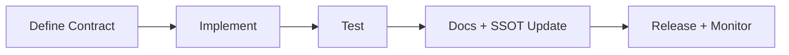

# ORAN Contracts Hub

Contracts define expected behavior, guardrails, and non-negotiable outcomes for key system surfaces.

## Contract Registry

| Contract | Scope | Status |
| --- | --- | --- |
| [CHAT_CONTRACT.md](CHAT_CONTRACT.md) | Chat orchestration and safety gate behavior | Active |
| [SEARCH_CONTRACT.md](SEARCH_CONTRACT.md) | Retrieval and result constraints | Active |
| [SCORING_CONTRACT.md](SCORING_CONTRACT.md) | Deterministic confidence and ranking model | Active |
| [AUTHZ_CONTRACT.md](AUTHZ_CONTRACT.md) | Authn/authz boundaries and role enforcement | Active |
| [INGESTION_CONTRACT.md](INGESTION_CONTRACT.md) | Intake, verification, and routing lifecycle | Active |

## Reading Order

1. `CHAT_CONTRACT.md`
2. `SEARCH_CONTRACT.md`
3. `SCORING_CONTRACT.md`
4. `AUTHZ_CONTRACT.md`
5. `INGESTION_CONTRACT.md`

## Contract Lifecycle

## Contract Change Checklist

- [ ] Contract doc updated.
- [ ] Implementation and tests updated.
- [ ] SSOT docs updated where applicable.
- [ ] `docs/ENGINEERING_LOG.md` entry added for contract-level changes.
- [ ] Runbooks updated if operational behavior changed.
