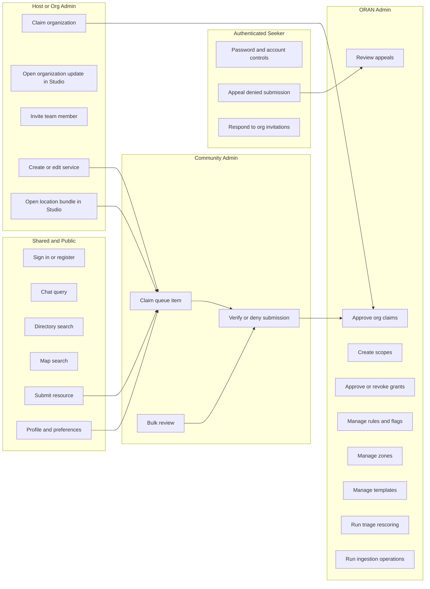
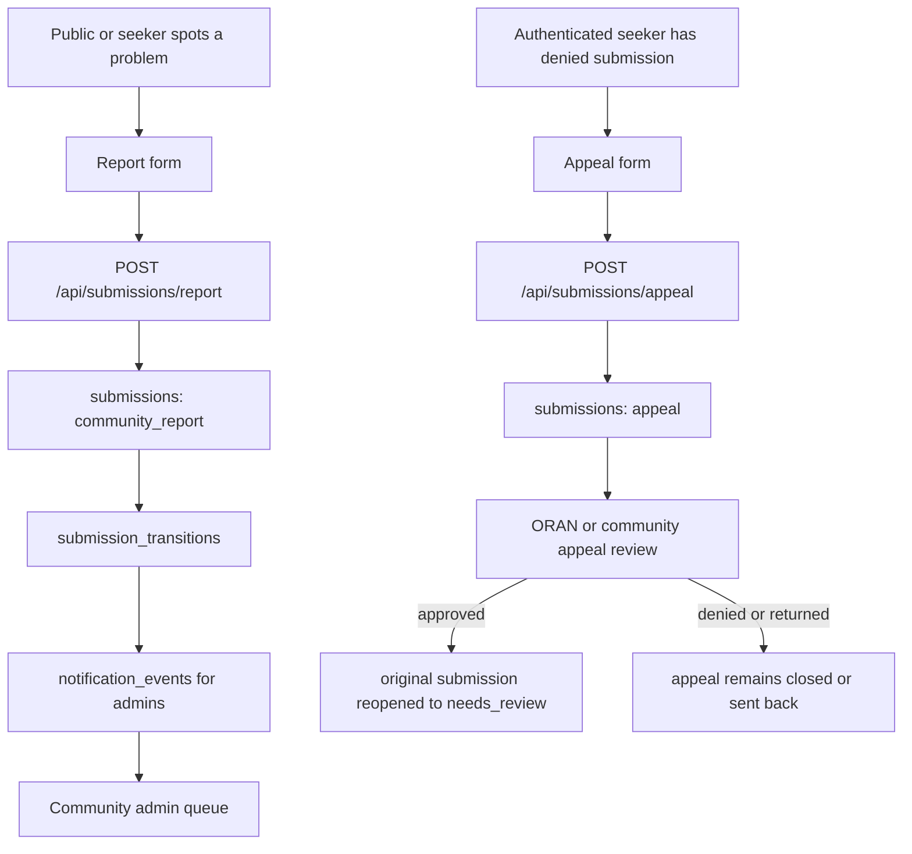
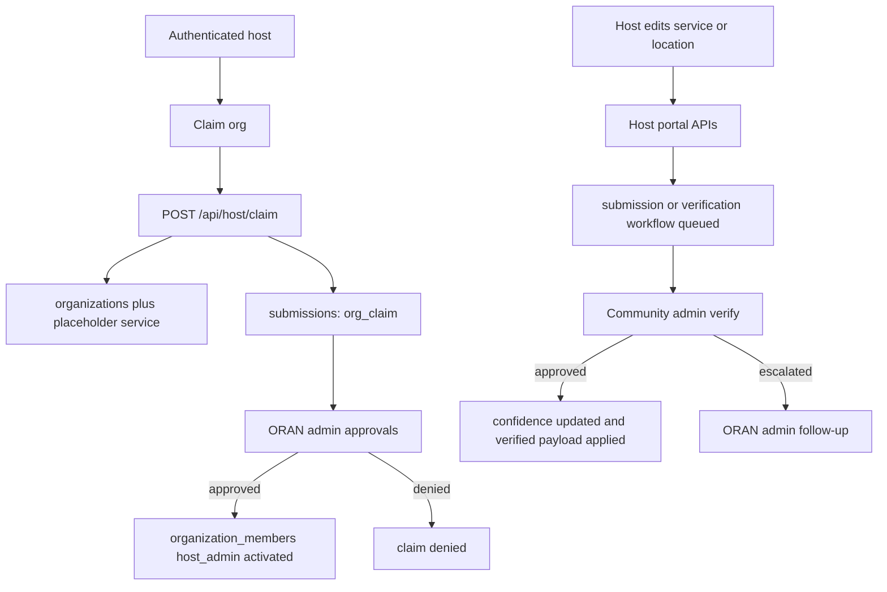
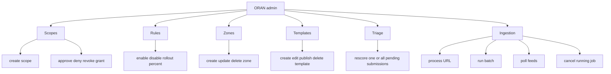

# ORAN Form Flow Evidence Map

Verified against repository implementation on 2026-03-08 UTC.

## Purpose

This document is the visual, traceable map of every confirmed ORAN form or state-changing operator control touched by a user scope in the current application.

It is designed for two audiences at once:

- leadership: clean role-based diagrams that show how forms move work through ORAN
- operators and engineers: proof-backed tables that tie each surface to code, auth guards, and storage or workflow effects

## Proof Standard

An item is included in the main inventory only if at least one of the following was confirmed in code:

- a rendered form or input surface in a page or shared component
- a state-changing button flow in a page client
- the exact API route that the surface calls

This document separates surfaces into two groups:

- transactional forms and operator controls: mutate state, create workflow items, or change access
- operational query forms: search, filter, or retrieve data without changing platform state

API endpoints that exist without a confirmed UI surface in this review are listed later as API-present but not counted as confirmed forms.

## Master Map

## High-Value Cross-Scope Flows

### Seeker correction and appeal path

### Host submission to moderation to platform decision

### Platform governance and control plane

## Confirmed Transactional Forms And Controls

### Shared and Public

| Scope | Surface | UI action | API or handler | Guard | Storage or effect | Proof |
| --- | --- | --- | --- | --- | --- | --- |
| Public, seeker, host, admin | Sign in selector | choose seeker, organization, or admin path; sign in with Microsoft, Google, or email | `next-auth` `signIn(...)` from shared sign-in page | public | creates session and redirects by selected callback path | `src/app/auth/signin/SignInPageClient.tsx` |
| Public | Register account | display name, email, password, optional phone | `POST /api/auth/register` | public with rate limit | inserts `user_profiles` credentials account with role `seeker` | `src/app/auth/signin/SignInPageClient.tsx`, `src/app/api/auth/register/route.ts` |
| Public or authenticated seeker | Submit resource suggestion | launch structured resource cards, save local draft, submit for review | `POST /api/resource-submissions`, `GET` or `PUT /api/resource-submissions/[id]` | anonymous allowed for public channel | creates submission-backed `form_instances` and `submissions`, stores local resume token for anonymous drafts, and keeps review timeline on the same object admins later inspect | `src/app/(seeker)/submit-resource/SubmitResourcePageClient.tsx`, `src/components/resource-submissions/ResourceSubmissionWorkspace.tsx`, `src/app/api/resource-submissions/route.ts`, `src/app/api/resource-submissions/[id]/route.ts` |
| Public or authenticated seeker | Report listing | service id, reason, details, optional contact email | `POST /api/submissions/report` | anonymous allowed | inserts `submissions` row of type `community_report`, inserts `submission_transitions`, triggers admin notifications and SLA | `src/app/(seeker)/report/ReportPageClient.tsx`, `src/app/api/submissions/report/route.ts` |

### Seeker

| Scope | Surface | UI action | API or handler | Guard | Storage or effect | Proof |
| --- | --- | --- | --- | --- | --- | --- |
| Authenticated seeker | Appeal denied submission | pick denied submission or id, enter appeal details | `POST /api/submissions/appeal` | authenticated, only own denied submission | inserts `submissions` row of type `appeal`, inserts `submission_transitions`, creates notifications and SLA | `src/app/(seeker)/appeal/AppealPageClient.tsx`, `src/app/api/submissions/appeal/route.ts` |
| Public or authenticated seeker | Profile edit and optional sync | preferred name, pronouns, headline, city or region, language, phone, email | local profile handlers, optional `PUT /api/profile` | local by default; authenticated plus explicit cross-device sync opt-in for server write | updates browser profile state and seeker context; only upserts `user_profiles` and `seeker_profiles` when sync is enabled on that device | `src/app/(seeker)/profile/ProfilePageClient.tsx`, `src/services/profile/syncPreference.ts`, `src/app/api/profile/route.ts` |
| Public or authenticated seeker | Save or unsave service bookmark | save toggle in directory, map, chat, detail, or saved flows; clear all saved services | local bookmark handlers, optional `POST` or `DELETE /api/saved` | local by default; authenticated plus explicit cross-device sync opt-in for server bookmark writes | updates `oran:saved-service-ids`; emits same-tab saved-state update events for shell/UI continuity; only upserts or deletes `saved_services` when sync is enabled on that device | `src/app/(seeker)/directory/DirectoryPageClient.tsx`, `src/app/(seeker)/map/MapPageClient.tsx`, `src/app/(seeker)/saved/SavedPageClient.tsx`, `src/app/(seeker)/service/[id]/ServiceDetailClient.tsx`, `src/components/chat/ChatWindow.tsx`, `src/services/saved/client.ts`, `src/services/profile/syncPreference.ts`, `src/app/api/saved/route.ts` |
| Authenticated seeker | Notification preferences | toggle and save notification settings | `PUT /api/user/notifications/preferences` | authenticated | upserts `notification_preferences` | `src/app/(seeker)/profile/ProfilePageClient.tsx`, `src/app/api/user/notifications/preferences/route.ts` |
| Authenticated seeker using credentials auth | Change password | current password, new password, confirm password | `POST /api/user/security/password` | authenticated, credentials provider only | updates `user_profiles.password_hash` | `src/app/(seeker)/profile/ProfilePageClient.tsx`, `src/app/api/user/security/password/route.ts` |
| Authenticated seeker | Export account data | request export from account controls | `POST /api/user/data-export` | authenticated | returns export bundle assembled from profile, submissions, memberships, notifications, preferences, saved services, and audit rows | `src/app/(seeker)/profile/ProfilePageClient.tsx`, `src/app/api/user/data-export/route.ts` |
| Authenticated seeker | Delete account data | destructive confirmation flow | `DELETE /api/user/data-delete` | authenticated | nullifies or deletes personal data across profile surfaces | `src/app/(seeker)/profile/ProfilePageClient.tsx`, `src/app/api/user/data-delete/route.ts` |
| Authenticated user | Organization invitation response | accept or decline pending host workspace invite | `GET /api/host/admins/invites`, `PATCH /api/host/admins` | authenticated invited user | reads pending `organization_members` invites and updates invite status to accepted or declined | `src/app/(seeker)/invitations/InvitationsPageClient.tsx`, `src/app/api/host/admins/invites/route.ts`, `src/app/api/host/admins/route.ts` |

### Host and Org Admin

| Scope | Surface | UI action | API or handler | Guard | Storage or effect | Proof |
| --- | --- | --- | --- | --- | --- | --- |
| Authenticated host | Claim organization | complete shared claim cards and submit for ORAN review | `POST /api/resource-submissions`, `GET` or `PUT /api/resource-submissions/[id]` | authenticated host | creates submission-backed host claim draft, keeps claim evidence and review timeline on one object, and projects approved claim into organization membership activation | `src/app/(host)/claim/ClaimPageClient.tsx`, `src/app/(host)/resource-studio/ResourceStudioPageClient.tsx`, `src/components/resource-submissions/ResourceSubmissionWorkspace.tsx`, `src/app/api/resource-submissions/route.ts`, `src/app/api/resource-submissions/[id]/route.ts` |
| Host member or host admin with org access | Open organization update in Resource Studio | review the published organization record, then jump into the submission-backed studio flow for structured organization or listing changes | `GET /api/host/organizations`, `POST /api/resource-submissions`, `GET` or `PUT /api/resource-submissions/[id]` | authenticated plus org access | keeps organization-facing updates attached to the same card workflow and review timeline as listing changes instead of editing the record inline on the page | `src/app/(host)/org/OrgPageClient.tsx`, `src/app/(host)/resource-studio/ResourceStudioPageClient.tsx`, `src/components/resource-submissions/ResourceSubmissionWorkspace.tsx`, `src/app/api/host/organizations/route.ts`, `src/app/api/resource-submissions/route.ts`, `src/app/api/resource-submissions/[id]/route.ts` |
| Host admin of org or ORAN admin | Invite or add team member | organization, email, display name, role | `POST /api/host/admins` | host admin of org or ORAN admin | inserts or updates `organization_members` invitation flow | `src/app/(host)/admins/AdminsPageClient.tsx`, `src/app/api/host/admins/route.ts` |
| Host org user | Create or edit listing in Resource Studio | organization, service, location, taxonomy, access, evidence, and review cards | `POST /api/resource-submissions`, `GET` or `PUT /api/resource-submissions/[id]` | org-scoped host access | creates or updates one submission-backed listing draft, stores source assertion on submit, and keeps review status attached to the same listing packet | `src/app/(host)/resource-studio/ResourceStudioPageClient.tsx`, `src/app/(host)/services/ServicesPageClient.tsx`, `src/components/resource-submissions/ResourceSubmissionWorkspace.tsx`, `src/app/api/resource-submissions/route.ts`, `src/app/api/resource-submissions/[id]/route.ts` |
| Host org user | Archive service | delete confirmation dialog | `DELETE /api/host/services/[id]` | org-scoped host access | archives service through host service route | `src/app/(host)/services/ServicesPageClient.tsx`, `src/app/api/host/services/[id]/route.ts` |
| Host org user | Open location bundle in Resource Studio | review the published location row and reopen the linked listing bundle in studio for structured location edits | `GET /api/host/locations`, `POST /api/resource-submissions`, `GET` or `PUT /api/resource-submissions/[id]` | org-scoped host access | keeps location edits attached to the same listing workflow, evidence packet, and review history as the surrounding service submission | `src/app/(host)/locations/LocationsPageClient.tsx`, `src/app/(host)/resource-studio/ResourceStudioPageClient.tsx`, `src/components/resource-submissions/ResourceSubmissionWorkspace.tsx`, `src/app/api/host/locations/route.ts`, `src/app/api/resource-submissions/route.ts`, `src/app/api/resource-submissions/[id]/route.ts` |
| Host org user | Managed forms workspace | browse templates, choose required org or coverage-zone launch anchors, understand reviewer target and timer before launch, start draft instances, save draft edits, and submit into review without leaving the portal | `GET /api/forms/templates`, `GET /api/forms/zones`, `GET` or `POST /api/forms/instances`, `GET` or `PUT /api/forms/instances/[id]` | `host_member` minimum plus org access on scoped instances | creates submission-backed `form_instances`, enforces required storage-scope anchors, validates payload and attachment rules on submit, applies template routing defaults, and stamps SLA timing when the form enters review | `src/app/(host)/forms/HostFormsPageClient.tsx`, `src/components/forms/FormVaultWorkspace.tsx`, `src/app/api/forms/templates/route.ts`, `src/app/api/forms/zones/route.ts`, `src/app/api/forms/instances/route.ts`, `src/app/api/forms/instances/[id]/route.ts` |

### Community Admin

| Scope | Surface | UI action | API or handler | Guard | Storage or effect | Proof |
| --- | --- | --- | --- | --- | --- | --- |
| Community admin | Review queue workbench | scan queue, filter by status or assignment, claim or release work, bulk approve or deny, and open shared detail review | `GET`, `POST`, or `DELETE /api/community/queue`; `PATCH /api/community/queue/bulk` | `community_admin` | keeps triage and assignment on an operator-optimized inbox while handing record-level review into the shared submission detail surface | `src/app/(community-admin)/queue/QueuePageClient.tsx`, `src/app/api/community/queue/route.ts`, `src/app/api/community/queue/bulk/route.ts` |
| Community admin | Claim or unclaim queue item | take ownership or release item from queue | `POST /api/community/queue`, `DELETE /api/community/queue` | `community_admin` | acquires or releases workflow lock on submission | `src/app/(community-admin)/queue/QueuePageClient.tsx`, `src/app/api/community/queue/route.ts` |
| Community admin | Bulk review | approve or deny up to 50 queue items with optional notes | `PATCH /api/community/queue/bulk` | `community_admin` | advances workflow in bulk and updates confidence scores on approval paths | `src/app/(community-admin)/queue/QueuePageClient.tsx`, `src/app/api/community/queue/bulk/route.ts` |
| Community admin | Detailed verification decision | review shared submission cards, then approve, deny, escalate, or return with required notes rules | `GET` or `PUT /api/resource-submissions/[id]`, `PUT /api/community/queue/[id]` | `community_admin` | renders the same submission-backed resource cards when available, writes reviewer notes, advances workflow, updates confidence scoring, and applies verified payload on approval | `src/app/(community-admin)/verify/VerifyPageClient.tsx`, `src/components/resource-submissions/ResourceSubmissionWorkspace.tsx`, `src/app/api/resource-submissions/[id]/route.ts`, `src/app/api/community/queue/[id]/route.ts` |
| Community admin | Managed form review workspace | inspect accessible managed-form payloads, see priority and SLA urgency, add reviewer notes, start review from submitted or queued forms, approve, deny, or return forms in-app | `GET /api/forms/instances`, `GET` or `PUT /api/forms/instances/[id]` | `community_admin` | keeps reviewer decisions on the same submission-backed form instance, scopes visibility to the reviewer’s configured community coverage, auto-assigns the reviewer who starts work, and advances the managed-form workflow under the shared submission SLA model | `src/app/(community-admin)/forms/CommunityFormsPageClient.tsx`, `src/components/forms/FormVaultWorkspace.tsx`, `src/app/api/forms/instances/route.ts`, `src/app/api/forms/instances/[id]/route.ts`, `src/services/community/scope.ts` |

### ORAN Admin

| Scope | Surface | UI action | API or handler | Guard | Storage or effect | Proof |
| --- | --- | --- | --- | --- | --- | --- |
| ORAN admin | Claim approvals workbench | scan claim queue, filter by status, take quick actions, and open shared card review | `GET` or `POST /api/admin/approvals` | `oran_admin` | keeps approval-board scanning and quick-action controls on a governance workbench while handing deep claim review into the shared submission detail route | `src/app/(oran-admin)/approvals/ApprovalsPageClient.tsx`, `src/app/api/admin/approvals/route.ts`, `src/app/(oran-admin)/approvals/[id]/ApprovalReviewPageClient.tsx` |
| ORAN admin | Approve or deny org claims | review shared claim cards with notes and final decision controls | `GET` or `PUT /api/resource-submissions/[id]`, `POST /api/admin/approvals` | `oran_admin` | advances `org_claim` workflow; shared claim detail renders the same card object the submitter completed; on approval activates service and creates `organization_members` host admin membership | `src/app/(oran-admin)/approvals/[id]/ApprovalReviewPageClient.tsx`, `src/components/resource-submissions/ResourceSubmissionWorkspace.tsx`, `src/app/api/resource-submissions/[id]/route.ts`, `src/app/api/admin/approvals/route.ts` |
| ORAN admin or higher reviewer path | Approve, deny, or return appeals | decision and notes | `POST /api/admin/appeals` | `community_admin` minimum, surfaced in ORAN admin portal | updates appeal workflow; on approval reopens original denied submission to `needs_review` with transition entry | `src/app/(oran-admin)/appeals/AppealsPageClient.tsx`, `src/app/api/admin/appeals/route.ts` |
| ORAN admin | Create platform scope | scope name, description, risk level, approval requirement | `POST /api/admin/scopes` | `oran_admin` | inserts `platform_scopes`, appends `scope_audit_log` | `src/app/(oran-admin)/scopes/ScopesPageClient.tsx`, `src/app/api/admin/scopes/route.ts` |
| ORAN admin | Approve, deny, or revoke scope grant | decision reason | `PUT` or `DELETE /api/admin/scopes/grants/[id]` | `oran_admin` | drives two-person grant decision or revocation | `src/app/(oran-admin)/scopes/ScopesPageClient.tsx`, `src/app/api/admin/scopes/grants/[id]/route.ts` |
| ORAN admin | Feature flag editing | enabled toggle and rollout percent | `PUT /api/admin/rules` | `oran_admin` | updates flag service state and audit metadata | `src/app/(oran-admin)/rules/RulesPageClient.tsx`, `src/app/api/admin/rules/route.ts` |
| ORAN admin | Coverage zone create | name, description, assigned admin, status | `POST /api/admin/zones` | `oran_admin` | inserts `coverage_zones` | `src/app/(oran-admin)/zone-management/ZoneManagementPageClient.tsx`, `src/app/api/admin/zones/route.ts` |
| ORAN admin | Coverage zone edit or delete | inline edit or destructive delete | `PUT` or `DELETE /api/admin/zones/[id]` | `oran_admin` | updates or deletes `coverage_zones` | `src/app/(oran-admin)/zone-management/ZoneManagementPageClient.tsx`, `src/app/api/admin/zones/[id]/route.ts` |
| ORAN admin | Template create | title, slug, role scope, category, language, tags, markdown, publish toggle | `POST /api/admin/templates` | `oran_admin` | creates template library record | `src/app/(oran-admin)/templates/TemplatesPageClient.tsx`, `src/app/api/admin/templates/route.ts` |
| ORAN admin | Template edit or delete | update metadata, content, publish state, or hard delete | `PUT` or `DELETE /api/admin/templates/[id]` | `oran_admin` | updates or removes template record | `src/app/(oran-admin)/templates/TemplatesPageClient.tsx`, `src/app/api/admin/templates/[id]/route.ts` |
| ORAN admin | Managed form vault | create platform form templates with routing defaults, inspect managed-form traffic, and take reviewer actions across all accessible instances | `GET` or `POST /api/forms/templates`, `GET /api/forms/instances`, `GET` or `PUT /api/forms/instances/[id]` | `oran_admin` | publishes reusable form schemas with default reviewer, priority, review timer, attachment policy, confirmation behavior, and queue semantics and provides global oversight of submission-backed form instances | `src/app/(oran-admin)/forms/OranFormsPageClient.tsx`, `src/components/forms/FormVaultWorkspace.tsx`, `src/app/api/forms/templates/route.ts`, `src/app/api/forms/instances/route.ts`, `src/app/api/forms/instances/[id]/route.ts` |
| ORAN admin | Triage rescore all | one-click rescoring for pending submissions | `POST /api/admin/triage` | `oran_admin` | recalculates triage scores across pending submissions | `src/app/(oran-admin)/triage/TriagePageClient.tsx`, `src/app/api/admin/triage/route.ts` |
| ORAN admin | Triage rescore one | one-click rescoring for a single submission | `POST /api/admin/triage/[id]` | `oran_admin` | recalculates one stored triage score | `src/app/(oran-admin)/triage/TriagePageClient.tsx`, `src/app/api/admin/triage/[id]/route.ts` |
| ORAN admin | Ingestion process single URL | URL input and process action | `POST /api/admin/ingestion/process` | `oran_admin` | runs ingestion pipeline and returns job, candidate, and stage results | `src/app/(oran-admin)/ingestion/IngestionPageClient.tsx`, `src/app/api/admin/ingestion/process/route.ts` |
| ORAN admin | Ingestion batch process | multiline URL textarea and run batch | `POST /api/admin/ingestion/batch` | `oran_admin` | creates batch ingestion job set | `src/app/(oran-admin)/ingestion/IngestionPageClient.tsx`, `src/app/api/admin/ingestion/batch/route.ts` |
| ORAN admin | Poll feeds | one-click feed polling | `POST /api/admin/ingestion/feeds/poll` | `oran_admin` | triggers due feed polling | `src/app/(oran-admin)/ingestion/IngestionPageClient.tsx`, `src/app/api/admin/ingestion/feeds/poll/route.ts` |
| ORAN admin | Cancel ingestion job | cancel button on queued or running job | `DELETE /api/admin/ingestion/jobs/[id]` | `oran_admin` | marks or cancels ingestion job | `src/app/(oran-admin)/ingestion/IngestionPageClient.tsx`, `src/app/api/admin/ingestion/jobs/[id]/route.ts` |
| ORAN admin | Ingestion source management | register a new ingestion source with trust level, domain rule, and optional seed URL from the Sources tab | `GET` or `POST /api/admin/ingestion/sources` | `oran_admin` | creates or upserts ingestion source registry entry and refreshes the operator-visible source inventory | `src/app/(oran-admin)/ingestion/IngestionPageClient.tsx`, `src/app/api/admin/ingestion/sources/route.ts` |

## Confirmed Operational Query Forms

These are real forms, but they are retrieval or filter surfaces rather than workflow mutation surfaces.

| Scope | Surface | UI action | API or handler | Guard | Effect | Proof |
| --- | --- | --- | --- | --- | --- | --- |
| Public or authenticated seeker | Chat input | free-text help request in chat window | `POST /api/chat` | public, rate limited | retrieval-first search session; no direct record mutation | `src/components/chat/ChatWindow.tsx`, `src/app/api/chat/route.ts` |
| Public or authenticated seeker | Directory search | text query, confidence filter, sort, location opt-in, category chips | `GET /api/search` | public | service retrieval only | `src/app/(seeker)/directory/DirectoryPageClient.tsx`, `src/app/api/search/route.ts` |
| Public or authenticated seeker | Map search | text query, confidence filter, sort, location opt-in, category chips | `GET /api/search` | public | service retrieval only | `src/app/(seeker)/map/MapPageClient.tsx`, `src/app/api/search/route.ts` |
| Host | Organization search | query filter across host organizations | `GET /api/host/organizations` | authenticated and org-scoped | filtered organization retrieval | `src/app/(host)/org/OrgPageClient.tsx`, `src/app/api/host/organizations/route.ts` |
| Host | Service list search | query filter and organization filter | host service list endpoints | authenticated and org-scoped | filtered service retrieval | `src/app/(host)/services/ServicesPageClient.tsx` |
| Community admin | Queue filters and tabs | queue state filters, claim views, pagination | `GET /api/community/queue` | `community_admin` | filtered queue retrieval only | `src/app/(community-admin)/queue/QueuePageClient.tsx`, `src/app/api/community/queue/route.ts` |
| ORAN admin | Triage queue filters | queue type tabs and pagination | `GET /api/admin/triage` | `oran_admin` | filtered triage retrieval only | `src/app/(oran-admin)/triage/TriagePageClient.tsx`, `src/app/api/admin/triage/route.ts` |
| ORAN admin | Ingestion jobs and candidates filters | status, tier, page filters | `GET /api/admin/ingestion/jobs`, `GET /api/admin/ingestion/candidates` | `oran_admin` | filtered operator visibility only | `src/app/(oran-admin)/ingestion/IngestionPageClient.tsx` |

## API-Present But Not Counted As Confirmed UI Forms

The following admin ingestion endpoints were confirmed in the repository, but this review did not confirm a corresponding rendered form or button on the current page implementation:

- `POST /api/admin/ingestion/candidates/[id]/publish`
- `GET /api/admin/ingestion/candidates/[id]/readiness`
- `POST /api/admin/ingestion/candidates/[id]/ai-review`
- `POST /api/admin/ingestion/candidates/[id]/suggestions`
- `POST /api/admin/ingestion/candidates/[id]/tags`

They are operationally important, but they are kept out of the main form count until the UI control is directly confirmed.

## Coverage Notes

- The inventory intentionally includes destructive dialogs and state-changing buttons, not just classic submit forms.
- Public discovery surfaces are separated from workflow mutation surfaces so leadership can read the diagrams without losing traceability.
- The document is implementation-grounded and should be refreshed whenever a route, role guard, or write target changes.

## Primary Evidence Set

- Shared auth: `src/app/auth/signin/SignInPageClient.tsx`, `src/app/api/auth/register/route.ts`
- Seeker: `src/app/(seeker)/report/ReportPageClient.tsx`, `src/app/(seeker)/appeal/AppealPageClient.tsx`, `src/app/(seeker)/profile/ProfilePageClient.tsx`, `src/app/(seeker)/invitations/InvitationsPageClient.tsx`, `src/app/api/submissions/report/route.ts`, `src/app/api/submissions/appeal/route.ts`, `src/app/api/profile/route.ts`, `src/app/api/user/notifications/preferences/route.ts`, `src/app/api/user/security/password/route.ts`, `src/app/api/user/data-export/route.ts`, `src/app/api/user/data-delete/route.ts`, `src/app/api/host/admins/invites/route.ts`, `src/app/api/host/admins/route.ts`
- Discovery: `src/components/chat/ChatWindow.tsx`, `src/app/api/chat/route.ts`, `src/app/(seeker)/directory/DirectoryPageClient.tsx`, `src/app/(seeker)/map/MapPageClient.tsx`, `src/app/api/search/route.ts`
- Host: `src/app/(host)/claim/ClaimPageClient.tsx`, `src/app/(host)/org/OrgPageClient.tsx`, `src/app/(host)/admins/AdminsPageClient.tsx`, `src/app/(host)/services/ServicesPageClient.tsx`, `src/app/(host)/locations/LocationsPageClient.tsx`, `src/app/api/host/claim/route.ts`, `src/app/api/host/organizations/route.ts`, `src/app/api/host/organizations/[id]/route.ts`, `src/app/api/host/admins/route.ts`, `src/app/api/host/services/route.ts`, `src/app/api/host/services/[id]/route.ts`, `src/app/api/host/locations/route.ts`, `src/app/api/host/locations/[id]/route.ts`
- Community admin: `src/app/(community-admin)/queue/QueuePageClient.tsx`, `src/app/(community-admin)/verify/VerifyPageClient.tsx`, `src/app/api/community/queue/route.ts`, `src/app/api/community/queue/[id]/route.ts`, `src/app/api/community/queue/bulk/route.ts`
- ORAN admin: `src/app/(oran-admin)/approvals/ApprovalsPageClient.tsx`, `src/app/(oran-admin)/appeals/AppealsPageClient.tsx`, `src/app/(oran-admin)/scopes/ScopesPageClient.tsx`, `src/app/(oran-admin)/rules/RulesPageClient.tsx`, `src/app/(oran-admin)/zone-management/ZoneManagementPageClient.tsx`, `src/app/(oran-admin)/templates/TemplatesPageClient.tsx`, `src/app/(oran-admin)/triage/TriagePageClient.tsx`, `src/app/(oran-admin)/ingestion/IngestionPageClient.tsx`, `src/app/api/admin/approvals/route.ts`, `src/app/api/admin/appeals/route.ts`, `src/app/api/admin/scopes/route.ts`, `src/app/api/admin/scopes/grants/[id]/route.ts`, `src/app/api/admin/rules/route.ts`, `src/app/api/admin/zones/route.ts`, `src/app/api/admin/zones/[id]/route.ts`, `src/app/api/admin/templates/route.ts`, `src/app/api/admin/templates/[id]/route.ts`, `src/app/api/admin/triage/route.ts`, `src/app/api/admin/triage/[id]/route.ts`, `src/app/api/admin/ingestion/process/route.ts`, `src/app/api/admin/ingestion/sources/route.ts`
