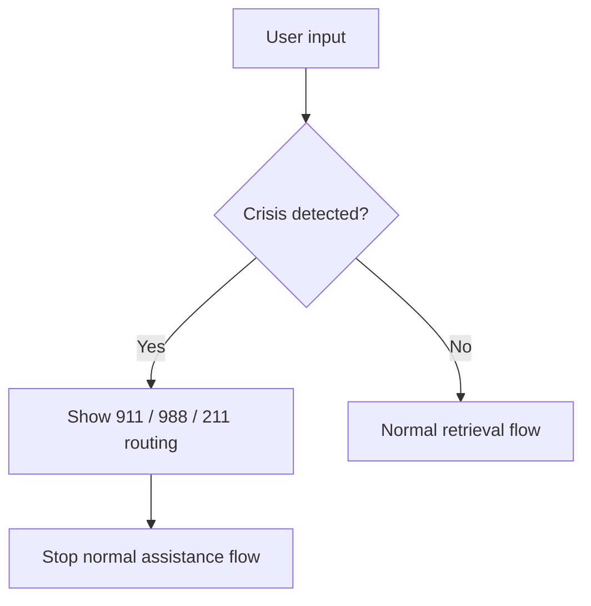
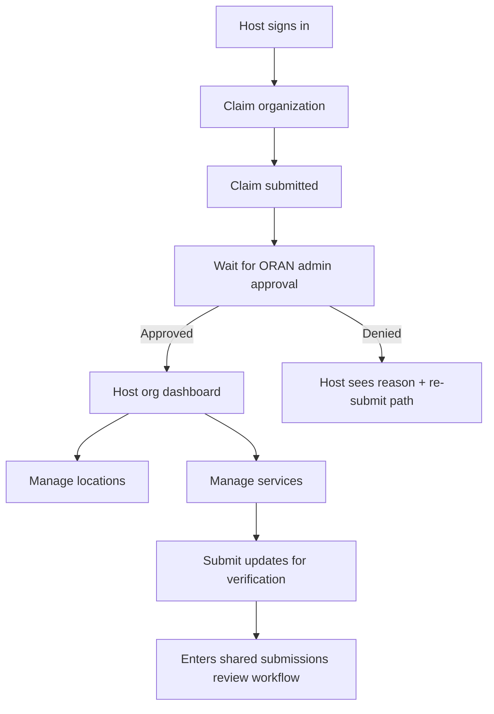
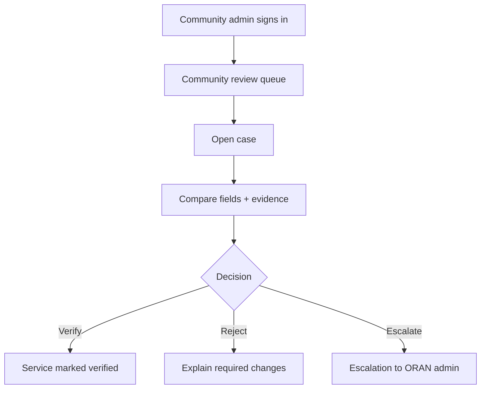
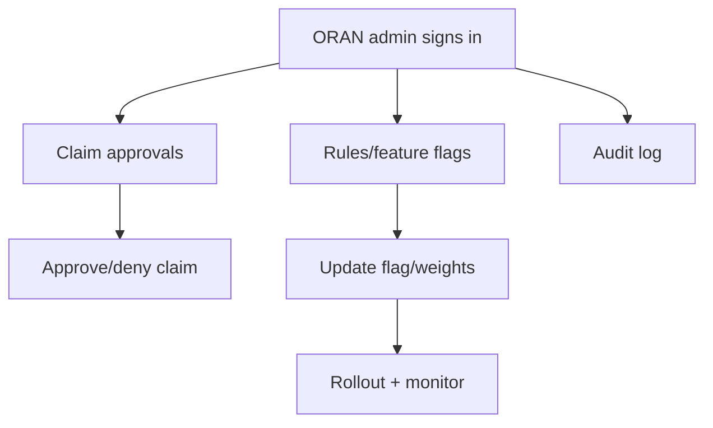

# ORAN UX Flows (End-to-End)

Status: **Accepted** (per ADR-0002)

These flows define what “complete” means. When implementing a page, ensure its upstream/downstream steps exist (even if some are stubbed with clear next actions).

---

## 1) Seeker: service discovery (core MVP loop)

```mermaid
flowchart TD
  A[Start: Seeker] --> AA{Signed in?}
  AA -->|Yes| AB[Use profile preferences (approximate)]
  AA -->|No| AC[Continue anonymously]
  AB --> B[Choose discovery mode]
  AC --> B

  B -->|Default| C[Chat]
  B --> D[Directory]
  B --> E[Map]

  C --> F[Results: service cards]
  D --> F
  E --> F

  F --> N{First-time / not signed in?}
  N -->|Yes| O[Non-blocking nudge: create profile]
  O --> P[Continue anonymously]
  O --> Q[Sign in / create profile]
  Q --> R[Consent to save preferences]

  F --> G[Service detail]
  G --> H[Primary action: call / website / directions]
  G --> I[Save service (requires auth)]
  G --> J[Report incorrect info / feedback]

  J --> K[Feedback stored (no PII)]
  K --> L[Verification workflow may be triggered]
```

Required UI behaviors:

- Confidence band visible on results.
- Eligibility caution always present.
- If a key field is missing (phone/hours), UI asks user to confirm with provider rather than inventing.

---

## 2) Crisis gate (preempts everything)



Requirements:

- Crisis routing must be visually prominent and accessible.
- Do not continue searching while crisis state is active.

---

## 3) Host: claim org → manage listings → submit for verification



Requirements:

- Every “submit” step must clearly show what is reviewed and expected turnaround.
- Host must see verification status per service.

---

## 4) Community admin: queue → verify → decision



Requirements:

- Decision must be auditable (who/when/why) without storing PII.
- Reject path must produce a clear, actionable “changes required”.

---

## 5) ORAN admin: approvals + rules + audit



Requirements:

- Risky changes should be feature-flagged.
- Admin actions must be logged (planned/contracted).
