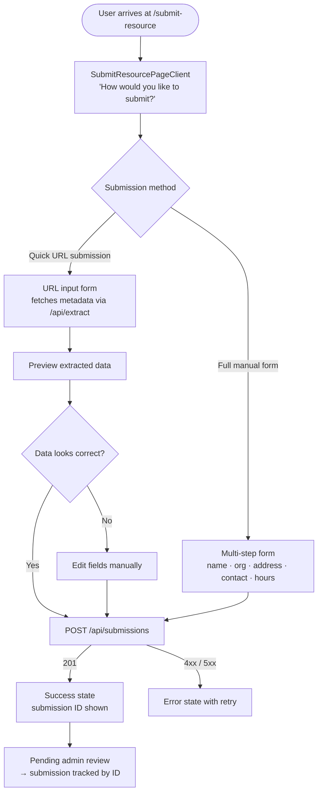

This document covers the three form-based seeker workflows: resource submission, listing reports, and appeal submissions.

---

## Submit a Resource (`/submit-resource`)



### Mobile layout notes

- Options grid: `grid gap-4 lg:grid-cols-2` — single column on mobile through `md`, two columns from `lg`.
- Option cards: `rounded-3xl border p-6` — sufficient tap area.
- Page is `noindex` to prevent form-spam via search engine discovery.

---

## Report a Listing (`/report`)

```mermaid
flowchart TD
    A([User on /service/:id]) --> B[Taps 'Report issue'\nfooter of ServiceCard]
    B --> C[/report?id=\nReportPageClient]

    C --> D[Select report category\nbad info · closed · spam · other]
    D --> E[Free-text details\noptional]
    E --> F[POST /api/reports]
    F -->|201| G[Success — thank you state]
    F -->|4xx| H[Error toast]

    G --> I[Return to /directory or /map]
```

### ARIA notes

- Category selection: radio pill group with `role="radiogroup"`.
- Submit button: disabled until category selected.
- Error states: `role="alert"`.

---

## Appeal a Decision (`/appeal`)

```mermaid
flowchart TD
    A([User arrives at /appeal]) --> B{Authenticated?}

    B -->|No| C[Sign-in gate\nshows reason + CTA]
    C --> D[/api/auth/signin?callbackUrl=/appeal]
    D --> A

    B -->|Yes| E[Load user's denied submissions\nGET /api/submissions?status=denied]
    E --> F{Has denied submissions?}

    F -->|No| G[Empty state\n'No denied submissions found']
    F -->|Yes| H[Select submission dropdown]

    H --> I[Set appeal reason\ntextarea]
    I --> J[Add evidence items\noptional — description · type · URL]
    J --> K[Submit appeal\nPOST /api/appeals]

    K -->|201| L[Success state\nappeal ID shown]
    K -->|4xx| M[Error toast]

    L --> N[Pending two-person review\nnotification will follow]
```

### Evidence sub-form

Each evidence entry is a repeating `rounded-[20px] border bg-orange-50/50 p-3` card with:

- Description (`aria-label="Evidence N description"`)
- Type select (`aria-label="Evidence N type"`)
- URL (`aria-label="Evidence N URL"`)
- Remove button (`aria-label="Remove evidence N"`)

Maximum 3 evidence items enforced in UI.

---

## Shared Form Patterns

| Pattern | Implementation |
|---------|---------------|
| Back navigation | `inline-flex items-center gap-1 text-sm` link — visible above PageHeader |
| Submit button | Full-width `w-full` on mobile; loading spinner via `Loader2 animate-spin` |
| Auth gate | Centered card with icon, reason, and sign-in CTA |
| Error display | `role="alert"` inline banner |
| Success display | Static success card — no redirect (user can copy submission ID) |

---

## Related Docs

- [API route contracts](../contracts/)
- [Admin review workflow](./admin-review.md) *(if created)*
- [Seeker discovery flow](./seeker-discovery.md)
