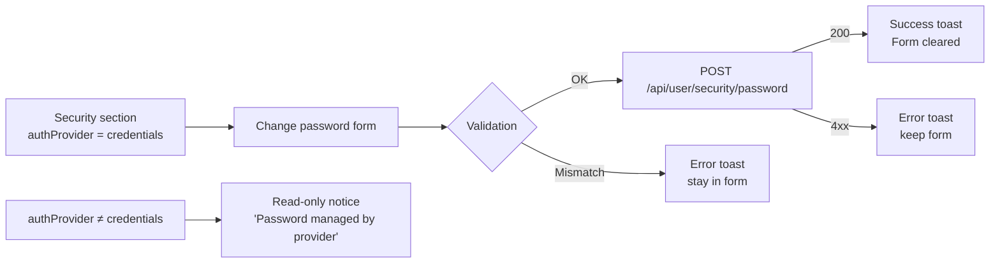

This document covers the profile management experience — from initial anonymous setup through to authenticated cross-device sync.

## Flow Chart

```mermaid
flowchart TD
    A([User arrives at /profile]) --> B{Authenticated?}

    B -->|No| C[Anonymous mode\nData in localStorage only]
    B -->|Yes| D[Fetch /api/profile\nMerge server + local]

    C --> E[Profile sections\ncollapsed by default]
    D --> E

    E --> F{Server sync enabled?}
    F -->|No| G[Show amber banner\n'Local until opt-in']
    F -->|Yes| H[Show green banner\n'Syncing across devices']

    G --> I[User fills sections]
    H --> I

    I --> J[Service Interests]
    I --> K[About Me\nage group · household]
    I --> L[Constraints\ndelivery mode · urgency]
    I --> M[Identity markers]
    I --> N[Location — city only]
    I --> O[Language preference]

    J & K & L & M & N & O --> P[Profile Strength meter\n0–100%]
    P --> Q{Score ≥ 67%?}
    Q -->|No| R[Prompt to fill more sections]
    Q -->|Yes| S[Strong / Complete badge]

    S --> T{Authenticated?}
    T -->|No| U[Prompt to sign in\nfor cross-device sync]
    T -->|Yes| V{serverSyncEnabled?}
    V -->|No| W[Toggle sync ON\n→ PUT /api/profile]
    V -->|Yes| X[Preferences auto-saved\nto account]

    U --> Y[/api/auth/signin]
    Y --> D

    style A fill:#fff7ed,stroke:#fb923c
    style X fill:#ecfdf5,stroke:#34d399
    style P fill:#eff6ff,stroke:#60a5fa
```

---

## Privacy Guarantees (must hold at all times)

1. **Location is always approximate** — city-level only, never street address.
2. **Anonymous by default** — all data stored in `localStorage` until explicit consent.
3. **One-click delete** — `DELETE /api/user/data-delete` clears server + clears `localStorage`.
4. **No PII in logs** — Sentry telemetry excludes profile fields.
5. **Conditional sync** — `serverSyncEnabled` flag gates every `PUT /api/profile` call.

---

## Profile Section Architecture

Each profile section is rendered as a `CollapsibleSection` component:

```
CollapsibleSection
├── toggle button (aria-expanded, aria-controls)
│   ├── icon
│   ├── title + badge
│   └── subtitle (current values summarized)
└── body (id= section-{id}-body)
    └── content (pills, radio groups, form fields)
```

### Touch target compliance

All `PillButton` and `RadioPillGroup` items: `min-h-[44px]`.
Section toggle buttons: `px-5 py-4` — sufficient touch target.

---

## Account Security Sub-flow



---

## Notification Preferences Sub-flow

| State | Behaviour |
|-------|-----------|
| `isLoading` | Shows "Loading…" text |
| Loaded | `overflow-x-auto` grid with event × channel matrix |
| Toggle | Optimistic update → `PUT /api/user/notifications/preferences` → toast |
| Network error | Rolls back optimistic update, shows error toast |

Grid structure (responsive):

```
[ Event label (flex-1) ]  [ In-App (w-14) ]  [ Email (w-14) ]
```

Wrapped in `overflow-x-auto -mx-1 px-1` with `min-w-[320px]` inner to prevent squeeze on 360px viewports.

---

## Related Docs

- [Discovery profile service](../../src/services/profile/) — `buildSeekerDiscoveryProfile`
- [Privacy model](../SECURITY_PRIVACY.md)
- [Seeker context contracts](../../src/services/profile/contracts.ts)
